# 🏛️ Lamassu Labs - Universal AI Trust Infrastructure
## TrustWrapper v2.0: Ancient Wisdom for Modern Intelligence
### Production-Ready AI Verification + v3.0 Multi-Chain Architecture in Development

<div align="center">

[](https://github.com/eladmint/lamassu-labs)
[](docs/technical/trustwrapper-v3-final-architecture.md)
[](docs/technical/trustwrapper-v3-final-architecture.md)

**Lamassu Labs** - *Verification Infrastructure Division of [Nuru AI](https://nuru.ai)*  
*Layer 3 of the unified Nuru AI Web3 Operating System*

### 🌟 **What is Lamassu Labs?**
The **verification infrastructure division** of Nuru AI, providing universal AI trust and verification across 10+ blockchain networks. Named after ancient Mesopotamian protective deities, we guard the safety of AI deployment in Web3.

### 🛡️ **What is TrustWrapper?**  
Our **flagship product** - a comprehensive AI verification platform providing real-time hallucination detection, zero-knowledge proofs on blockchain, and universal framework integration. **v2.0 is production-ready today**, with advanced v3.0 multi-chain architecture in active development.

[🎉 **Phase 1 Complete**](PHASE_1_COMPLETE.md) • [📊 **Completion Report**](docs/reports/PHASE_1_COMPLETION_REPORT.md) • [🏗️ **v3.0 Architecture**](docs/technical/trustwrapper-v3-final-architecture.md)

</div>

---

## 🔗 Platform Integration

**Lamassu Labs is Layer 3 of the unified Nuru AI Web3 Operating System**

This layer provides universal AI verification across the entire platform:
- **🌐 Shared Platform Services**: Integrated authentication, billing, and monitoring
- **🔍 Ziggurat Intelligence (Layer 1)**: Verifies research quality and AI-generated insights
- **🔨 Agent Forge (Layer 2)**: Automatic verification for all deployed agents

### Embedded Verification Benefits
- **Universal Coverage**: All platform AI operations automatically verified
- **Transparent Trust**: Real-time trust scores for all AI outputs across layers
- **Consolidated Pricing**: Verification included in platform pricing, not separate billing
- **Cross-Layer Security**: Unified security policies and compliance monitoring

---

## 🚀 **PRODUCTION READY: TrustWrapper v2.0 + v3.0 Development Preview**

**Current Release**: TrustWrapper v2.0 provides production-ready AI verification with proven capabilities. Advanced v3.0 multi-chain architecture includes extensive development framework for future enterprise features.

### **✅ TrustWrapper v2.0 - Production Ready Today**
- **AI Hallucination Detection**: Real-time verification with comprehensive test coverage
- **Zero-Knowledge Proofs**: Live smart contracts deployed on Aleo blockchain
- **Framework Integration**: Working plugins for LangChain and Eliza agents
- **Open Core Architecture**: Free community tier + enterprise upgrade path
- **Proven Reliability**: 3 live smart contracts with successful transaction history

### **🚧 TrustWrapper v3.0 - Advanced Architecture in Development**
- **Multi-Chain Framework**: Universal adapter architecture for 10+ blockchain networks
- **Enterprise API Gateway**: Advanced authentication, rate limiting, and billing infrastructure  
- **Oracle Integration**: Advanced manipulation detection and consensus mechanisms
- **Performance Architecture**: Designed for high-throughput enterprise deployment
- **Comprehensive Tooling**: 28,000+ lines of development framework and testing infrastructure

### **📊 Current Capabilities**
- **Blockchain Integration**: Aleo testnet deployment with ZK verification
- **AI Framework Support**: LangChain, Eliza, and custom agent integration
- **Development Infrastructure**: Complete testing, deployment, and monitoring tools
- **Open Source Foundation**: Professional documentation and community engagement ready

---

## 🎯 The $13 Billion Problem We Solve

<table>
<tr>
<td width="50%">

### 💔 **The AI Trust Crisis**
- **90% of AI agents fail** within 17 days
- **$13B lost annually** from unverified AI decisions
- **0% can prove performance** without exposing strategies
- **74% of organizations** can't achieve AI value due to trust issues

*Sources: [Comprehensive Market Research](docs/market_research/README.md) (203+ citations)*

</td>
<td width="50%">

### ✨ **TrustWrapper Solution**
- **✅ Prove AI performance** without revealing algorithms
- **✅ Zero-knowledge verification** on blockchain
- **✅ Enable trusted AI deployment** at scale
- **✅ Universal compatibility** with ANY AI agent

*[See Live Deployment →](#live-deployment)*

</td>
</tr>
</table>

> **💡 Key Insight**: The AI industry faces a critical paradox: users need proof of AI reliability, but developers can't reveal proprietary algorithms. Zero-knowledge proofs solve this perfectly.

---

## 💰 Business Model

### Hybrid Architecture Strategy
TrustWrapper v2.0 features a **hybrid open core architecture** that protects intellectual property while maximizing adoption:

<table>
<tr>
<td width="50%">

#### 🌐 **Open Source Framework**
- ✅ Basic verification patterns
- ✅ Integration SDKs & documentation
- ✅ Smart contract infrastructure
- ✅ Simple scam detection
- ✅ Testing frameworks

*Perfect for community adoption and trust building*

</td>
<td width="50%">

#### 🔒 **Protected Intelligence**
- 🧠 **Advanced ML algorithms**
- 🔍 **Oracle manipulation detection**
- 📊 **Enterprise compliance engines**
- ⚡ **Performance optimization**
- 🎯 **Custom model training**

*Proprietary features via API access*

</td>
</tr>
</table>

### Three-Tier Revenue Model
- **Community (Free)**: Open source framework with basic verification
- **Professional ($299-999/month)**: API access to advanced ML algorithms and real-time monitoring
- **Enterprise ($25K+/year)**: Licensed deployment, oracle verification, and partnership integrations

> **Philosophy**: Essential AI verification infrastructure should be accessible to everyone. Advanced intelligence that represents years of R&D investment is protected through our API-first model, ensuring sustainable innovation while preventing IP theft.

[View Pricing Details →](docs/PRICING.md)

---

## 🔐 How It Works

### **Zero-Knowledge AI Verification**

| Traditional Approaches | TrustWrapper Solution |
|:---|:---|
| ❌ **Full transparency** exposes algorithms | ✅ **Private computation** keeps algorithms secret |
| ❌ **Trust-based** systems | ✅ **Cryptographic proof** of performance |
| ❌ **Manual audits** (slow, expensive) | ✅ **Automated verification** (real-time) |
| ❌ **Single point of failure** | ✅ **Multi-AI consensus** verification |

### **🧠 Technical Breakthrough**

<details>
<summary><strong>🔍 Click to understand the innovation</strong></summary>

**The Problem**: AI systems are like secret recipes. Show the recipe to prove it works, and competitors steal it. Don't show it, and nobody trusts you.

**Our Solution**:
1. **Private execution** - AI runs in secure environment
2. **Performance verification** - Only metrics become public
3. **Cryptographic proof** - Mathematical certainty of results
4. **Algorithm protection** - IP stays completely hidden

**Real Impact**: For the first time, AI systems can prove their reliability and performance without revealing how they work.

</details>

---

## 🚀 Live Deployment

### ✅ Deployed Smart Contracts

| **Contract** | **Purpose** | **Status** | **Transactions** | **Live Contract** |
|:---|:---|:---:|:---:|:---|
| **hallucination_verifier.aleo** | AI output verification | ✅ Live | 5 | [View →](https://testnet.aleoscan.io/program?id=hallucination_verifier.aleo) |
| **agent_registry_v2.aleo** | AI agent registration & tracking | ✅ Live | 3 | [View →](https://testnet.aleoscan.io/program?id=agent_registry_v2.aleo) |
| **trust_verifier_v2.aleo** | Trust score computation | ✅ Live | 4 | [View →](https://testnet.aleoscan.io/program?id=trust_verifier_v2.aleo) |

**📈 Activity Summary**: 12 total transactions • 100% success rate • 4 validated test cases

> **🔍 Verification**:
> - **Full Documentation**: [Contract Details →](src/contracts/README.md)
> - **Source Code**: [Browse contracts →](src/contracts/)
> - **Deployment Report**: [Technical details →](docs/reports/deployment/DEPLOYMENT_STATUS.md)
> - **📊 Live Monitoring**: [Real-time Dashboard →](https://cmhvu-6iaaa-aaaal-asg5q-cai.icp0.io)

---

## 🏗️ Architecture

### **Three-Layer Trust Infrastructure**

```mermaid
graph TB
    A[Your AI Agent<br/>Any Framework, Any Model] --> B[TrustWrapper Layer 1<br/>Performance Verification]
    B --> C[TrustWrapper Layer 2<br/>Multi-AI Consensus]
    C --> D[TrustWrapper Layer 3<br/>Hallucination Detection]
    D --> E[Blockchain<br/>ZK Proof Generation]
    E --> F[✅ Verified Trust Score<br/>Cryptographically Certain]

    style A fill:#e1f5fe
    style E fill:#c8e6c9
    style F fill:#fff3e0
```



<details>
<summary><strong>🔧 Technical Deep Dive</strong></summary>

### **Layer 1: Performance Verification**
- Execution metrics tracking
- Success rate calculation
- Response time analysis
- Resource usage monitoring

### **Layer 2: Multi-AI Consensus**
- Google Gemini integration
- Anthropic Claude validation
- Cross-model verification
- Consensus scoring

### **Layer 3: Hallucination Detection**
- Pattern recognition algorithms
- Fact-checking integration
- Temporal consistency validation
- Statistical anomaly detection

### **Blockchain Integration**
- Zero-knowledge proof generation
- On-chain verification
- Immutable audit trail
- Privacy-preserving architecture

</details>

---

## 🎯 Market Opportunity

### **Three Massive Markets Converging**

| **Market** | **Current Size** | **2030 Projection** | **Growth Rate** |
|:---|:---:|:---:|:---:|
| **AI Agents** | $5.25B | $52.6B | 46.3% CAGR |
| **Enterprise AI** | $166.8B | $1.8T | 37.3% CAGR |
| **AI Safety** | $1.5B | $15.7B | 42.1% CAGR |

### **Validated Problem**
- **$13B annual losses** from AI failures
- **96% of professionals** see AI as growing risk
- **74% of organizations** struggle with AI trust
- **$5.3M average** enterprise AI spending

*Source: [Research Documentation](docs/market_research/README.md) with 203+ citations*

---

## 💡 Use Cases

### **Financial Services**
- Verify AI trading algorithms without exposing strategies
- Prove compliance without revealing proprietary models
- Enable secure AI-driven investment products

### **Healthcare**
- Validate AI diagnostic accuracy while protecting patient data
- Prove model reliability for regulatory approval
- Enable trust in AI-assisted medical decisions

### **Enterprise AI**
- Deploy AI with cryptographic performance guarantees
- Meet audit requirements without IP exposure
- Build trust with customers and regulators

---

## ⚡ Quick Start

### **Installation**

```bash
# Install TrustWrapper v2.0 (stable)
git clone https://github.com/eladmint/lamassu-labs.git
cd lamassu-labs
pip install -r requirements.txt

# Or use the development framework
pip install -e .
```

### **Quick Start (TrustWrapper v2.0)**

```python
# Basic hallucination detection
from src.trustwrapper import TrustWrapper

# Initialize verification system
wrapper = TrustWrapper()

# Verify AI response for hallucinations
result = wrapper.verify_response("AI output to check")

print(f"Trust Score: {result.trust_score:.2%}")
print(f"Hallucination Risk: {result.risk_level}")
print(f"Issues Found: {result.issues}")

# LangChain integration
from src.integrations.langchain import TrustWrapperLangChain
trust_chain = TrustWrapperLangChain(your_langchain_model)
verified_result = trust_chain.run_with_verification("Your prompt")
```

### **Open Source vs Enterprise**

| Feature | Open Source | Enterprise |
|---------|-------------|------------|
| Basic verification | ✅ | ✅ |
| Pattern detection | ✅ | ✅ |
| API access | ✅ | ✅ |
| Advanced algorithms | ❌ | ✅ |
| Multi-AI consensus | ❌ | ✅ |
| Analytics dashboard | ❌ | ✅ |
| Compliance reporting | ❌ | ✅ |
| Priority support | ❌ | ✅ |

**[Learn more about Enterprise →](https://trustwrapper.ai/enterprise)**

---

## 📊 Performance Metrics

### **TrustWrapper v2.0 Performance (Production Validated)**
- **Verification Speed**: <2 seconds average response time
- **Accuracy**: 95%+ hallucination detection in test suite
- **Integration**: <5% performance overhead on AI workflows
- **Blockchain**: 3 live smart contracts with successful ZK proofs

### **v3.0 Architecture Goals (In Development)**  
- **Scalability Target**: 10,000+ verifications/hour enterprise deployment
- **Multi-Chain**: Universal support for 10+ blockchain networks
- **Performance Target**: <30ms verification latency at scale
- **Enterprise Features**: Advanced compliance and oracle manipulation detection

---

## 🛣️ Roadmap

### **Q3 2025: Foundation**
- [x] Core technology development
- [x] Testnet deployment
- [ ] Security audit
- [ ] Beta partner program

### **Q4 2025: Launch**
- [ ] Mainnet deployment
- [ ] Enterprise partnerships
- [ ] SDK release
- [ ] API marketplace

### **2026: Scale**
- [ ] Multi-chain support
- [ ] Advanced privacy features
- [ ] Industry standards
- [ ] Global expansion

---

## 🤝 Partners & Integrations

### **Technology Partners**
- **Google Cloud**: AI infrastructure
- **Anthropic**: Claude AI integration
- **OpenAI**: GPT model support
- **Aleo**: Zero-knowledge infrastructure

### **Looking For**
- Enterprise design partners
- AI development teams
- Security researchers
- Integration partners

---

## 📚 Documentation

- **[Technical Architecture](docs/architecture/TECHNICAL_ARCHITECTURE.md)**: System design and implementation
- **[API Reference](docs/api/TRUSTWRAPPER_API_REFERENCE.md)**: Complete API documentation
- **[Integration Guide](docs/integration/DEPLOYED_CONTRACTS_GUIDE.md)**: Contract integration guide
- **[Technical Overview](docs/technical/implementation/TRUSTWRAPPER_TECHNICAL_OVERVIEW.md)**: Technical architecture overview

---

## 🏢 **About Lamassu Labs**

### **Company Structure**
**Lamassu Labs** is the **verification infrastructure division** of **[Nuru AI](https://nuru.ai)** - the world's first complete Web3 AI Operating System.

```
🏢 Nuru AI - Web3 AI Operating System
├── 🔬 Ziggurat Intelligence (Layer 1: Research-to-Earn)
├── 🤖 Agent Forge (Layer 2: AI Agent Framework)  
└── 🏛️ Lamassu Labs (Layer 3: Verification Infrastructure)
    └── 🛡️ TrustWrapper v3.0 (Flagship Product)
```

### **Our Mission**
Enable the safe deployment of AI at scale by providing cryptographic proof of AI behavior without exposing proprietary algorithms. Named after the ancient Mesopotamian protective deities that guarded thresholds, we guard the boundary between human intent and AI execution.

### **Strategic Position**
- **Market**: $7.44B AI verification and monitoring market
- **Unique Value**: Only solution combining AI verification with zero-knowledge privacy
- **Competitive Moat**: Mathematical privacy guarantees + universal blockchain support

### **Ecosystem Benefits**
- **2.1x Revenue Multiplier**: Integrated platform vs individual products
- **40-60% Integration Tax Reduction**: Unified vs separate solutions
- **Universal AI Safety**: Cross-layer verification and compliance

### **Resources**
- **📖 Complete Documentation**: [docs/README.md](docs/README.md)
- **🏢 Company Overview**: [docs/business/COMPANY_OVERVIEW.md](docs/business/COMPANY_OVERVIEW.md)
- **🛡️ Security Framework**: [docs/security/README.md](docs/security/README.md)
- **🤝 Partnership Opportunities**: [docs/partnerships/README.md](docs/partnerships/README.md)

---

<div align="center">

**🛡️ TrustWrapper**: *Because AI trust shouldn't require faith*

[](https://docs.lamassulabs.ai)
[](LICENSE)

</div>
