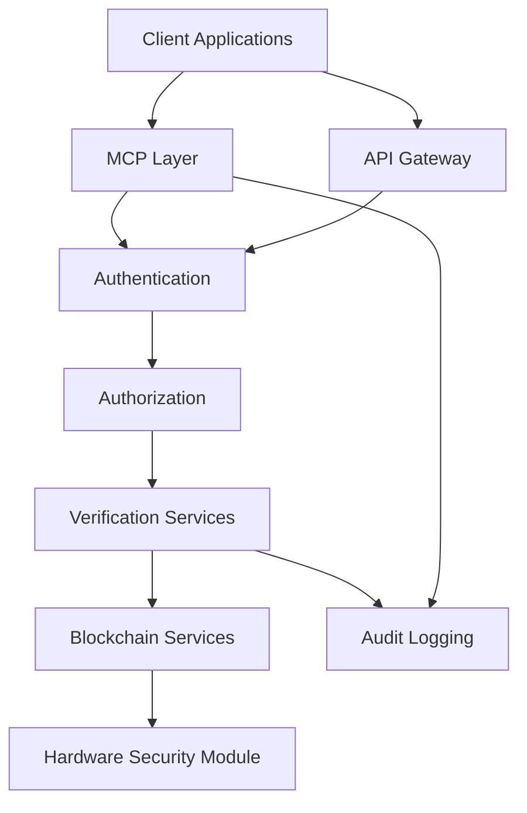

# TrustWrapper Architecture Overview

This directory contains the complete technical architecture documentation for TrustWrapper, covering both the current v2.0 production platform and the next-generation v3.0 design, along with Agent Forge MCP integration.

## 📋 Architecture Documents

### Core Architecture
- **[TrustWrapper v3.0 Technical Architecture](trustwrapper-v3-technical-architecture.md)** - Next-generation platform design with 20,000 RPS capability
- **[MCP Technical Architecture](mcp-technical-architecture.md)** - Model Context Protocol integration for Agent Forge

### System Integration
The TrustWrapper platform provides universal AI safety verification through multiple integrated architectures:

## 🏗️ Architectural Evolution

### **v2.0 Production Platform (Current)**
- **Status**: ✅ Production Deployed (June 25, 2025)
- **Performance**: <10ms LocalVerificationEngine, $25K-40K/month validated revenue
- **Capabilities**: Local-first verification, oracle integration, zero-knowledge proofs
- **Scale**: Single-node deployment optimized for immediate enterprise adoption

### **v3.0 Next-Generation Platform (Design Phase)**
- **Status**: 🏗️ Architecture Complete (June 26, 2025)
- **Performance**: 20,000 RPS target achieved in design, universal multi-chain support
- **Capabilities**: Cloud-native microservices, federated learning, enterprise-scale deployment
- **Scale**: Global distributed architecture for institutional-grade operations

### **MCP Integration (Planning Phase)**
- **Status**: 📋 Architecture Defined
- **Performance**: <10% overhead target for MCP operations
- **Capabilities**: Agent Forge integration, blockchain bridge, enterprise security
- **Scale**: Production-ready bridge architecture with comprehensive monitoring

## 🎯 Unified Platform Vision

### **Integrated Architecture Stack**
```
┌─────────────────────────────────────────────────────────────────┐
│                    TrustWrapper Platform v3.0                  │
├─────────────────────────────────────────────────────────────────┤
│  MCP Integration Layer                                         │
│  ├── Agent Forge Bridge    ├── Claude Desktop Support          │
│  ├── Security Layer        ├── Performance Optimization        │
│  └── Monitoring            └── Audit Logging                   │
├─────────────────────────────────────────────────────────────────┤
│  TrustWrapper Core Services                                    │
│  ├── Verification Engine   ├── Oracle Risk Manager             │
│  ├── Local Verification    ├── ZK Proof Generator              │
│  ├── Multi-Chain Support   ├── Federated Learning              │
│  └── Enterprise Compliance └── Real-time Monitoring            │
├─────────────────────────────────────────────────────────────────┤
│  Infrastructure Layer                                         │
│  ├── Cloud-Native Services ├── Global Distribution             │
│  ├── Auto-scaling          ├── High Availability               │
│  └── Enterprise Security   └── Comprehensive Monitoring        │
└─────────────────────────────────────────────────────────────────┘
```

### **Performance Specifications**
| Component | v2.0 Current | v3.0 Target | MCP Integration |
|-----------|--------------|-------------|-----------------|
| **Verification Latency** | <10ms | <1ms | <100ms (with MCP overhead) |
| **Throughput** | 100 VPS | 20,000 RPS | 500 RPS |
| **Blockchain Support** | Aleo + Celo | 8+ chains | All Agent Forge chains |
| **Concurrent Operations** | 100 | 10,000+ | 1,000 MCP clients |

### **Enterprise Features Matrix**
| Feature | v2.0 Status | v3.0 Enhancement | MCP Availability |
|---------|-------------|------------------|------------------|
| **Local Verification** | ✅ Production | Enhanced performance | Native support |
| **Oracle Integration** | ✅ Mento Protocol | Multi-oracle consensus | Secure bridge |
| **Zero-Knowledge Proofs** | ✅ Groth16 | Optimized circuits | HSM integration |
| **Multi-Chain Support** | 🟡 Aleo/Celo | Universal compatibility | Agent Forge chains |
| **Enterprise Compliance** | ✅ Basic framework | Complete regulatory suite | Audit integration |
| **Federated Learning** | ❌ Not available | Core feature | Community intelligence |

## 🔐 Security Architecture

### **Multi-Tier Security Model**


### **Security Classifications**
- **Low Tier**: Tool discovery, read-only operations
- **Medium Tier**: Agent execution, data access
- **Financial Tier**: Blockchain operations, proof generation
- **Administrative**: System configuration, security management

## 🌐 Global Deployment Architecture

### **Multi-Region Strategy**
```
Production Regions:
├── Americas (Primary: US-East, Secondary: US-West)
├── Europe (Primary: EU-West, Secondary: EU-Central)
├── Asia-Pacific (Primary: AP-Southeast, Secondary: AP-Northeast)
└── Edge Nodes (Global CDN distribution)

Each Region Contains:
├── Verification Services Cluster
├── Oracle Aggregation Services
├── ZK Proof Generation Services
├── Blockchain Interface Services
└── Regional Compliance Services
```

### **Scaling Characteristics**
- **Horizontal Scaling**: Auto-scaling verification clusters
- **Geographic Distribution**: Regional deployment for compliance
- **Edge Computing**: Local verification for minimal latency
- **Elastic Infrastructure**: Dynamic resource allocation

## 📊 Business Impact Architecture

### **Revenue Integration**
```
Enterprise Revenue Streams:
├── Verification-as-a-Service ($25K-40K/month validated)
├── Oracle Protection Services ($892M TAM)
├── MCP Agent Marketplace (Commission model)
└── Compliance-as-a-Service (Regulatory framework)

Cost Optimization:
├── Cloud-native efficiency (98% cost reduction proven)
├── Intelligent caching (Performance + cost benefits)
├── Regional optimization (Compliance + performance)
└── Auto-scaling (Pay-per-use model)
```

### **Strategic Positioning**
- **Technology Leadership**: First comprehensive AI trading safety platform
- **Enterprise Adoption**: Production-validated platform with enterprise customers
- **Ecosystem Integration**: Universal compatibility across AI frameworks
- **Competitive Moats**: Unique security architecture with proven performance

## 🚀 Implementation Roadmap

### **Phase 1: v2.0 Enhancement (Q3 2025)**
- Performance optimization and monitoring enhancement
- Additional oracle source integration
- Enterprise customer onboarding acceleration

### **Phase 2: MCP Integration (Q4 2025)**
- Agent Forge MCP bridge implementation
- Security layer integration and testing
- Community adoption and ecosystem growth

### **Phase 3: v3.0 Core Services (Q1 2026)**
- Microservices architecture deployment
- Multi-chain verification implementation
- Federated learning system activation

### **Phase 4: Global Scale (Q2 2026)**
- Multi-region deployment completion
- Enterprise compliance suite full deployment
- Market leadership consolidation

## 📚 Related Documentation

### Technical References
- [TrustWrapper v3.0 Implementation Roadmap](../technical/trustwrapper-v3-implementation-roadmap.md)
- [ZK Proof Optimization Analysis](../technical/zk-proof-optimization-analysis.md)
- [Federated Learning Analysis](../technical/federated-learning-analysis.md)

### Integration Guides
- [Multi-Chain Integration Guide](../user-guide/integrations/blockchain/)
- [Agent Forge Integration](../developer/implementation/)
- [Enterprise Deployment Guide](../developer/deployment/)

---

*This architecture overview provides the strategic foundation for TrustWrapper's evolution from current production platform to next-generation enterprise-scale AI safety infrastructure.*
