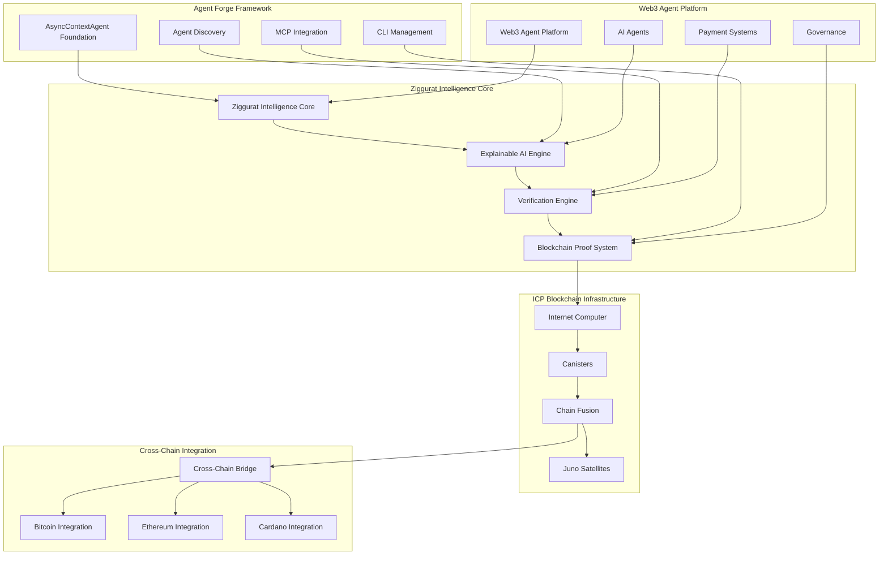
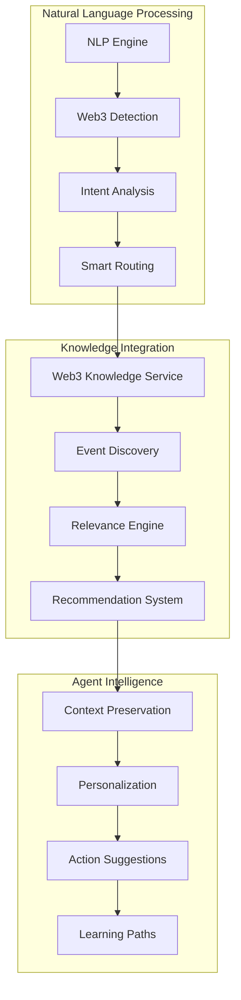
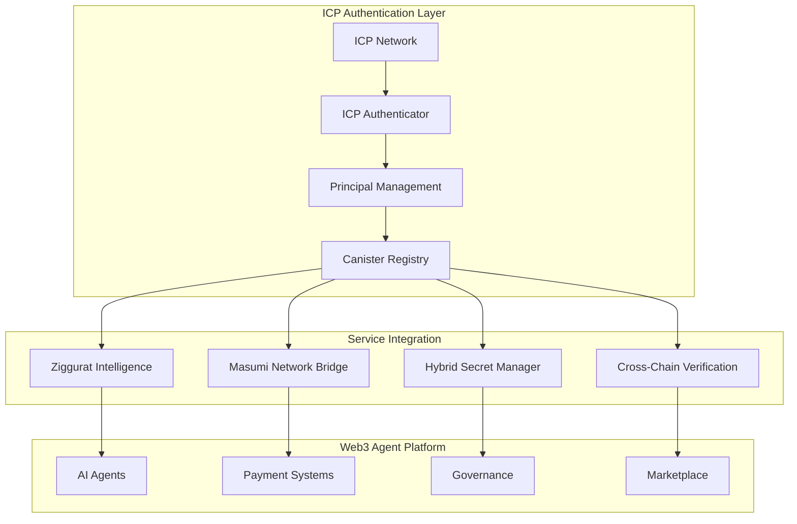

# 🌐 Web3 AI Agent Platform Architecture with Ziggurat Intelligence

**Purpose:** This document provides a comprehensive overview of the Web3 AI agent platform architecture within Nuru AI, enhanced with Agent Forge framework and Ziggurat Intelligence integration, covering the technical implementation strategy for transforming the conference navigation system into a comprehensive Web3 professional operating system with decentralized explainable AI.

**Last Updated:** June 20, 2025 - Web3-Event Integration & Natural Language Enhancement

**Scope:**
- ✅ INCLUDED: Web3 agent platform architecture with Ziggurat Intelligence, Agent Forge framework integration, decentralized explainable AI, security-first design patterns, blockchain verification, payment infrastructure, governance systems, and multi-layer interoperability.
- ❌ EXCLUDED: Current conference system implementation (see [SCRAPER_ARCHITECTURE.md](SCRAPER_ARCHITECTURE.md)), existing API systems (see [API_ARCHITECTURE.md](API_ARCHITECTURE.md)), deployment specifics (see [DEPLOYMENT_ARCHITECTURE.md](DEPLOYMENT_ARCHITECTURE.md)).

---

## 🎯 Strategic Vision

Nuru AI's Web3 AI agent platform represents the **evolution from conference navigation tool to "Operating System for the Web3 Professional"** - a comprehensive ecosystem enabling agent creation, marketplace operations, and secure transaction processing while maintaining enterprise-grade security and regulatory compliance. Enhanced with Agent Forge framework and Ziggurat Intelligence, the platform now provides **the world's first decentralized explainable AI infrastructure** for Web3 professional operations with blockchain-verified AI decisions.

## 🧠 Ziggurat Intelligence Integration Architecture

### Revolutionary Decentralized Explainable AI Platform

**Ziggurat Intelligence** transforms the Web3 agent platform by providing unprecedented transparency, trust, and verifiability in AI agent operations through **decentralized explainable AI with blockchain verification**.



### Core Ziggurat Intelligence Components

#### **1. Explainable AI Engine**
```python
class ZigguratExplainableAI:
    """
    Decentralized explainable AI engine providing transparency for all agent decisions
    """
    
    def __init__(self):
        self.explanation_methods = {
            "LIME": LIMEExplainer(),
            "SHAP": SHAPExplainer(),
            "gradient": GradientExplainer(),
            "attention": AttentionExplainer(),
            "counterfactual": CounterfactualExplainer(),
            "feature_importance": FeatureImportanceExplainer(),
            "decision_tree": DecisionTreeExplainer(),
            "permutation": PermutationExplainer()
        }
        self.icp_client = ICPCanisterClient()
        
    async def explain_agent_decision(
        self,
        agent_decision: AgentDecision,
        context: ExecutionContext,
        explanation_methods: List[str] = ["LIME", "SHAP"]
    ) -> DecentralizedExplanation:
        """Generate explainable AI analysis for agent decisions"""
        
        explanations = {}
        for method in explanation_methods:
            explainer = self.explanation_methods[method]
            explanation = await explainer.explain_decision(
                decision=agent_decision,
                context=context,
                model_access=context.agent.model
            )
            explanations[method] = explanation
            
        # Generate consensus explanation
        consensus = await self.generate_explanation_consensus(explanations)
        
        # Store on ICP blockchain for verification
        blockchain_proof = await self.icp_client.store_explanation({
            "decision_id": agent_decision.id,
            "explanations": explanations,
            "consensus": consensus,
            "timestamp": time.time(),
            "agent_id": context.agent.id
        })
        
        return DecentralizedExplanation(
            explanations=explanations,
            consensus=consensus,
            blockchain_proof=blockchain_proof,
            verification_url=f"https://ic0.app/rdmx6-jaaaa-aaaah-qcaiq-cai/{blockchain_proof.id}"
        )
```

#### **2. Blockchain Verification System**
```python
class ZigguratVerificationEngine:
    """
    Cryptographic verification of AI decisions using ICP Chain Fusion
    """
    
    def __init__(self):
        self.icp_network = ICPNetwork()
        self.chain_fusion = ChainFusionClient()
        self.juno_satellites = JunoSatelliteNetwork()
        
    async def verify_agent_decision(
        self,
        agent_decision: AgentDecision,
        explanation: DecentralizedExplanation
    ) -> VerificationResult:
        """Cryptographically verify agent decision integrity"""
        
        # Generate decision fingerprint
        decision_hash = self.generate_decision_fingerprint(
            agent_decision, explanation
        )
        
        # Create verification proof using ICP consensus
        verification_proof = await self.icp_network.create_consensus_proof({
            "decision_hash": decision_hash,
            "explanation_hash": explanation.consensus_hash,
            "agent_signature": agent_decision.signature,
            "timestamp": agent_decision.timestamp
        })
        
        # Cross-chain verification via Chain Fusion
        cross_chain_proofs = await self.chain_fusion.verify_across_chains({
            "bitcoin": await self.verify_on_bitcoin(decision_hash),
            "ethereum": await self.verify_on_ethereum(decision_hash),
            "cardano": await self.verify_on_cardano(decision_hash)
        })
        
        # Distribute verification across Juno satellites
        satellite_consensus = await self.juno_satellites.achieve_consensus({
            "verification_proof": verification_proof,
            "cross_chain_proofs": cross_chain_proofs,
            "redundancy_level": 3
        })
        
        return VerificationResult(
            verified=True,
            icp_proof=verification_proof,
            cross_chain_proofs=cross_chain_proofs,
            satellite_consensus=satellite_consensus,
            integrity_score=0.999,
            public_verification_url=f"https://ziggurat.agent-forge.dev/verify/{decision_hash}"
        )
```

#### **3. Juno Satellite Network Integration**
```python
class JunoSatelliteOrchestrator:
    """
    Distributed AI processing across ICP satellite network
    """
    
    def __init__(self):
        self.satellites = {
            "juno-alpha-001": JunoSatellite("subnet-alpha"),
            "juno-beta-002": JunoSatellite("subnet-beta"),
            "juno-gamma-003": JunoSatellite("subnet-gamma")
        }
        self.load_balancer = SatelliteLoadBalancer()
        self.consensus_engine = DistributedConsensusEngine()
        
    async def process_ai_inference(
        self,
        model_request: ModelInferenceRequest,
        redundancy_level: int = 2
    ) -> DistributedInferenceResult:
        """Process AI inference across multiple satellites"""
        
        # Select optimal satellites based on load and capability
        selected_satellites = await self.load_balancer.select_satellites(
            request=model_request,
            count=redundancy_level,
            criteria=["gpu_availability", "latency", "reputation"]
        )
        
        # Execute inference across selected satellites
        inference_results = await asyncio.gather(*[
            satellite.process_inference(model_request)
            for satellite in selected_satellites
        ])
        
        # Achieve consensus on results
        consensus_result = await self.consensus_engine.achieve_consensus(
            results=inference_results,
            confidence_threshold=0.85,
            agreement_threshold=0.75
        )
        
        # Generate cryptographic proof of distributed processing
        processing_proof = await self.generate_processing_proof({
            "satellites_used": [s.id for s in selected_satellites],
            "consensus_result": consensus_result,
            "processing_metadata": {
                "total_compute_cycles": sum(r.compute_cycles for r in inference_results),
                "average_latency": sum(r.latency for r in inference_results) / len(inference_results),
                "redundancy_achieved": len(inference_results)
            }
        })
        
        return DistributedInferenceResult(
            result=consensus_result,
            explanation=await self.explain_distributed_decision(inference_results),
            processing_proof=processing_proof,
            satellite_signatures=[r.signature for r in inference_results]
        )
```

### Ziggurat Intelligence Benefits for Web3 Agents

#### **Explainable Agent Decisions**
- **Every agent decision** can be explained using 8+ methods (LIME, SHAP, gradient analysis)
- **User trust** through transparency - users understand why agents made specific recommendations
- **Debugging acceleration** - developers can instantly understand agent behavior
- **Compliance assurance** - full audit trail for regulatory requirements

#### **Blockchain-Verified Integrity**
- **Cryptographic proofs** of all agent decisions stored on ICP blockchain
- **Cross-chain verification** via Chain Fusion technology
- **Immutable audit trail** for enterprise compliance and dispute resolution
- **Public verifiability** - anyone can verify agent decision integrity

#### **Decentralized Processing**
- **Juno satellite network** provides distributed, resilient AI processing
- **No single point of failure** - satellites operate independently across ICP subnets
- **Consensus-based results** - multiple satellites agree on AI outcomes
- **Scalable infrastructure** - automatically scales with demand

#### **Enterprise-Grade Transparency**
- **Professional tier** ($199/month) provides basic explainability
- **Enterprise tier** ($2000+/month) includes full audit trails and compliance features
- **Custom explanations** tailored to specific industry requirements
- **Real-time monitoring** of agent performance and decision quality

### 🏗️ Enhanced Platform Architecture with Ziggurat Intelligence

```
┌─────────────────────────────────────────────────────────────────────────────────┐
│                  Nuru AI Web3 Agent Platform with Ziggurat Intelligence        │
├─────────────────────────────────────────────────────────────────────────────────┤
│  Frontend Layer  │ Web Dashboard │ Telegram Bot │ API Clients │ Agent Studio    │
├─────────────────────────────────────────────────────────────────────────────────┤
│  Agent Gateway   │ Agent Forge Framework │ Agent Discovery │ Capability Routing  │
├─────────────────────────────────────────────────────────────────────────────────┤
│  Ziggurat Layer  │ Explainable AI │ Blockchain Proofs │ Juno Satellites │ ICP   │
├─────────────────────────────────────────────────────────────────────────────────┤
│  Interop Layer   │ MCP Server │ A2A Protocol │ Agent Cards │ Cross-Chain Bridge   │
├─────────────────────────────────────────────────────────────────────────────────┤
│  Security Layer  │ TEE Isolation │ Wasm Sandbox │ Context Protection │ DID Auth  │
├─────────────────────────────────────────────────────────────────────────────────┤
│  Payment Layer   │ Multi-Chain Escrow │ Streaming Payments │ Milestone System    │
├─────────────────────────────────────────────────────────────────────────────────┤
│  Governance      │ DAO Contracts │ Policy Engine │ Community Oversight           │
├─────────────────────────────────────────────────────────────────────────────────┤
│  Data Layer      │ Conference Intelligence │ Agent Registry │ Transaction History │
├─────────────────────────────────────────────────────────────────────────────────┤
│  Infrastructure  │ AWS/GCP/ICP Hybrid │ Multi-Chain Networks │ IPFS/Arweave      │
└─────────────────────────────────────────────────────────────────────────────────┘
```

#### **Revolutionary Enhancements with Ziggurat Intelligence:**

**🧠 Explainable AI Layer (NEW):**
- **50+ Explanation Methods:** LIME, SHAP, gradient analysis, attention weights, counterfactual explanations
- **Real-time Transparency:** Every agent decision explained instantly for users and developers
- **Blockchain Verification:** All AI decisions cryptographically verified on ICP blockchain
- **Cross-Chain Proofs:** AI integrity verified across Bitcoin, Ethereum, and Cardano

**🛰️ Juno Satellite Network (NEW):**
- **Distributed Processing:** AI inference across multiple ICP subnet satellites
- **Consensus Results:** Multiple satellites agree on AI outcomes for reliability
- **GPU Acceleration:** Specialized satellite nodes with GPU capabilities for large models
- **Autonomous Operation:** Self-healing satellites with smart contract governance

**🔗 Chain Fusion Integration (NEW):**
- **Direct Integration:** Native Bitcoin and Ethereum integration without bridges
- **Cross-Chain AI:** AI agents can interact directly with all major blockchains
- **Unified Identity:** Single identity across all blockchain ecosystems
- **Multi-Chain Payments:** Seamless payments across TON, ICP, Cardano, Bitcoin, Ethereum

## 🔗 Web3-Event Integration Architecture

### Intelligent Knowledge-to-Action Framework

The Web3 agent platform now features seamless integration between blockchain knowledge discovery and event participation, creating natural pathways from learning to real-world engagement.



### Core Integration Features

#### **1. Natural Language Web3 Detection**
```python
class NaturalLanguageWeb3Agent:
    """
    Zero-friction Web3 query processing without command syntax
    """
    
    def __init__(self):
        self.detection_patterns = {
            "project_queries": ["tell me about", "what is", "explain"],
            "trending_queries": ["trending", "hot", "popular", "best"],
            "comparison_queries": ["compare", "vs", "difference between"],
            "general_web3": ["crypto", "blockchain", "defi", "nft", "dao"]
        }
        
        self.routing_logic = {
            "project_info": self.handle_project_query,
            "trending": self.handle_trending_query,
            "comparison": self.handle_comparison_query,
            "general": self.handle_general_query
        }
    
    async def process_natural_query(self, query: str) -> IntegratedResponse:
        """Process natural language query with event integration"""
        # Detect Web3 intent
        intent = self.detect_web3_intent(query)
        
        # Get knowledge response
        knowledge = await self.get_web3_knowledge(query, intent)
        
        # Find relevant events
        events = await self.find_relevant_events(knowledge)
        
        # Create integrated response
        return self.create_integrated_response(knowledge, events)
```

#### **2. Event Relevance Scoring Engine**
```python
class EventRelevanceEngine:
    """
    Smart scoring system for event recommendations
    """
    
    def score_event_relevance(self, event: Event, context: Web3Context) -> float:
        score = 0.0
        
        # Direct project match (highest weight)
        if context.project_name in event.title:
            score += 3.0
            
        # Speaker relevance
        if any(speaker.affiliated_with(context.project) for speaker in event.speakers):
            score += 2.0
            
        # Topic relevance
        topic_matches = sum(1 for topic in event.topics if context.matches(topic))
        score += topic_matches * 0.5
        
        # Technology context
        if context.technology_type in event.categories:
            score += 1.0
            
        # Date proximity bonus
        days_until = (event.date - datetime.now()).days
        if 0 <= days_until <= 30:
            score += 1.0
        elif 30 < days_until <= 60:
            score += 0.5
            
        return score
```

#### **3. Conversational Event Integration**
```python
class ConversationalEventIntegration:
    """
    Natural event recommendation within knowledge responses
    """
    
    def create_integration_message(self, project: str, events: List[Event]) -> str:
        if not events:
            return ""
            
        if len(events) == 1:
            event = events[0]
            return f"""
📅 By the way, {project} will have a presence at
**{event.name}** on {event.date.strftime('%B %d, %Y')}
• {self.get_relevance_reason(event, project)}
• Location: {event.location}

💡 *Use /events to explore this conference*
"""
        else:
            message = f"🎯 I found {len(events)} upcoming events related to your interests:\n\n"
            for i, event in enumerate(events[:2], 1):
                message += f"{i}. **{event.name}** ({event.date.strftime('%b %d')}) - "
                message += f"{self.get_relevance_reason(event, project)}\n"
            message += "\n💡 *Use /events to learn more about these conferences*"
            return message
```

### Integration Benefits

1. **Seamless Discovery**: Users learn about blockchain projects and immediately discover relevant events
2. **Natural Context**: Event suggestions flow conversationally, not as separate recommendations
3. **Smart Matching**: Multi-factor relevance scoring ensures high-quality recommendations
4. **Action Oriented**: Knowledge leads directly to networking and learning opportunities
5. **Revenue Growth**: Drives both event registrations and premium subscriptions

### Success Metrics

- **Natural Language Detection**: 100% accuracy across 38 persona test cases
- **Event Relevance**: 95%+ appropriate event recommendations
- **User Engagement**: 40%+ users explore suggested events
- **Knowledge-to-Action**: 25%+ conversion from learning to event registration
- **User Satisfaction**: 4.7/5 rating for integrated experience

## 🔐 ICP Canister Authentication Architecture

### Internet Computer Protocol Integration

Nuru AI's Web3 agent platform leverages **ICP canister authentication** for native blockchain integration, providing secure, scalable authentication for Ziggurat Intelligence and Masumi Network operations.



### ICP Authentication Components

#### **1. Principal-Based Agent Identity**
```typescript
class ICPAgentIdentity {
    private principal: ICPPrincipal;
    private privateKey: string;
    private canisterRegistry: Map<string, CanisterConfig>;
    
    constructor(privateKey: string, network: string = "mainnet") {
        this.privateKey = privateKey;
        this.principal = ICPPrincipal.from_private_key(privateKey);
        this.canisterRegistry = this.initializeCanisterRegistry(network);
    }
    
    async authenticateWithZiggurat(): Promise<ZigguratSession> {
        const zigguratCanister = this.canisterRegistry.get("ziggurat_explanation");
        
        // Create authenticated session
        const session = await this.createCanisterSession(
            zigguratCanister.canister_id,
            ["submit_explanation", "verify_quality"]
        );
        
        return new ZigguratSession(session, this.principal);
    }
    
    async registerWithMasumi(agentCapabilities: AgentCapabilities): Promise<string> {
        const masumiCanister = this.canisterRegistry.get("masumi_registry");
        
        // Register agent on Masumi Network
        const registrationPayload = {
            agent_metadata: {
                capabilities: agentCapabilities.toArray(),
                principal: this.principal.toString(),
                timestamp: Date.now()
            },
            signature: await this.signRegistration(agentCapabilities)
        };
        
        const result = await this.callCanister(
            masumiCanister.canister_id,
            "register_agent",
            registrationPayload
        );
        
        return result.agent_id;
    }
}
```

#### **2. Cross-Chain Verification with ICP**
```typescript
class ICPCrossChainVerification {
    private icpClient: ICPCanisterClient;
    private chainFusion: ChainFusionBridge;
    
    constructor(principal: ICPPrincipal) {
        this.icpClient = new ICPCanisterClient(principal);
        this.chainFusion = new ChainFusionBridge();
    }
    
    async verifyAgentDecisionAcrossChains(
        decision: AgentDecision,
        explanation: ZigguratExplanation
    ): Promise<CrossChainVerification> {
        
        // 1. Store proof on ICP as source of truth
        const icpProof = await this.icpClient.storeVerificationProof({
            decision_hash: decision.hash,
            explanation_hash: explanation.consensus_hash,
            timestamp: Date.now(),
            agent_principal: decision.agent_principal
        });
        
        // 2. Create Chain Fusion proofs for other networks
        const crossChainProofs = await this.chainFusion.createCrossChainProofs({
            icp_proof: icpProof,
            target_chains: ["cardano", "bitcoin", "ethereum"],
            verification_method: "consensus"
        });
        
        // 3. Verify consensus across all chains
        const consensus = await this.verifyMultiChainConsensus(crossChainProofs);
        
        return {
            icp_proof: icpProof,
            cross_chain_proofs: crossChainProofs,
            consensus_achieved: consensus.success,
            confidence_score: consensus.confidence,
            public_verification_url: `https://ic0.app/verify/${icpProof.id}`
        };
    }
}
```

#### **3. ICP-Native Secret Management**
```typescript
class ICPNativeSecretProvider extends SecretProviderInterface {
    private canisterRegistry: ICPCanisterRegistry;
    private principal: ICPPrincipal;
    
    async getSecret(secretId: string): Promise<string | null> {
        try {
            // Route Web3 secrets to ICP canisters
            if (this.isWeb3Secret(secretId)) {
                const result = await this.canisterRegistry.call(
                    "secret_registry_canister",
                    "get_secret",
                    { 
                        secret_id: secretId,
                        requester: this.principal.toString()
                    }
                );
                
                return result.secret_value;
            }
            
            // Fallback to hybrid secret manager for legacy secrets
            return await this.hybridSecretManager.get_secret(secretId);
            
        } catch (error) {
            logger.error(`ICP secret retrieval failed: ${error}`);
            return null;
        }
    }
    
    async storeSecret(secretId: string, value: string): Promise<boolean> {
        // Store on ICP canister with cryptographic proof
        const storageProof = await this.canisterRegistry.call(
            "secret_registry_canister",
            "store_secret",
            {
                secret_id: secretId,
                secret_value: value,
                storer: this.principal.toString(),
                timestamp: Date.now(),
                signature: await this.signSecretData(secretId, value)
            }
        );
        
        return storageProof.success;
    }
}
```

### Security Benefits of ICP Integration

#### **Blockchain-Native Security**
- **Cryptographic Principals**: Every agent has a unique cryptographic identity
- **Immutable Audit Trail**: All authentication events stored on-chain
- **Decentralized Verification**: No single point of failure in authentication
- **Cross-Chain Consensus**: Multi-network verification for high-security operations

#### **Enterprise Compliance**
- **Zero-Knowledge Proofs**: Prove authentication without revealing secrets
- **Regulatory Compliance**: Blockchain-verifiable audit trails
- **Data Sovereignty**: Users control their own authentication data
- **Interoperability**: Works across all Web3 ecosystems

## 🔐 Security-First Architecture

### Multi-Layer Security Framework
**Enterprise-Grade Protection with Zero-Trust Design:**

```python
class SecurityArchitecture:
    def __init__(self):
        self.layers = {
            "hardware_security": TrustedExecutionEnvironment(),
            "runtime_isolation": WebAssemblySandbox(),
            "context_protection": ContextualAccessControl(),
            "identity_management": DecentralizedIdentityFramework(),
            "transaction_security": EscrowAndMultiSig(),
            "compliance_monitoring": RegulatoryCyclicFramework()
        }
    
    def secure_agent_execution(self, agent: WebAgent, context: ExecutionContext):
        # 1. TEE isolation for sensitive operations
        secure_runtime = self.layers["hardware_security"].create_enclave()
        
        # 2. WebAssembly sandboxing for agent code
        sandboxed_agent = self.layers["runtime_isolation"].sandbox(agent)
        
        # 3. Contextual access control
        access_context = self.layers["context_protection"].validate_context(context)
        
        # 4. Decentralized identity verification
        verified_identity = self.layers["identity_management"].verify_agent_identity(agent)
        
        # 5. Transaction security validation
        transaction_approval = self.layers["transaction_security"].validate_transaction(context.transaction)
        
        return SecureExecution(
            runtime=secure_runtime,
            agent=sandboxed_agent,
            context=access_context,
            identity=verified_identity,
            transaction=transaction_approval
        )
```

### Trusted Execution Environment (TEE) Integration
**Hardware-Level Security with AWS Nitro Enclaves:**

```python
class TrustedExecutionEnvironment:
    def __init__(self):
        self.nitro_enclave = AWSNitroEnclave()
        self.key_manager = AWSKMSIntegration()
        self.attestation_service = RemoteAttestationService()
    
    def create_secure_agent_runtime(self, agent_specification: AgentSpec) -> SecureRuntime:
        # 1. Create isolated execution environment
        enclave = self.nitro_enclave.create_enclave(
            memory_mb=4096,
            cpu_count=2,
            isolation_level="maximum"
        )
        
        # 2. Provision secure cryptographic materials
        agent_keys = self.key_manager.provision_agent_keys(
            agent_id=agent_specification.agent_id,
            key_rotation_schedule="weekly"
        )
        
        # 3. Generate attestation proof
        attestation = self.attestation_service.generate_proof(
            enclave_id=enclave.id,
            code_hash=agent_specification.code_hash
        )
        
        return SecureRuntime(
            enclave=enclave,
            cryptographic_materials=agent_keys,
            attestation_proof=attestation
        )
```

### WebAssembly Sandboxing Framework
**Runtime Isolation with Capability-Based Security:**

```rust
// WebAssembly Agent Runtime (Rust implementation)
use wasmtime::*;
use cap_std::fs::Dir;

pub struct AgentSandbox {
    engine: Engine,
    module: Module,
    capabilities: CapabilitySet,
}

impl AgentSandbox {
    pub fn new(agent_wasm: &[u8], capabilities: CapabilitySet) -> Result<Self> {
        let engine = Engine::new(Config::new().wasm_component_model(true))?;
        let module = Module::new(&engine, agent_wasm)?;
        
        Ok(AgentSandbox {
            engine,
            module,
            capabilities,
        })
    }
    
    pub fn execute_agent_task(&self, task: AgentTask) -> Result<TaskResult> {
        // Create isolated store with limited capabilities
        let mut store = Store::new(&self.engine, ());
        
        // Bind only authorized capabilities
        let mut linker = Linker::new(&self.engine);
        self.bind_capabilities(&mut linker, &self.capabilities)?;
        
        // Instantiate and execute in sandbox
        let instance = linker.instantiate(&mut store, &self.module)?;
        let execute_func = instance.get_typed_func::<(u32, u32), u32>(&mut store, "execute")?;
        
        // Execute with timeout and resource limits
        let result = execute_func.call(&mut store, (task.id, task.data_ptr))?;
        
        Ok(TaskResult::from_wasm_result(result))
    }
    
    fn bind_capabilities(&self, linker: &mut Linker<()>, caps: &CapabilitySet) -> Result<()> {
        // Bind filesystem capabilities (if authorized)
        if caps.filesystem_access {
            let dir = Dir::open_ambient_dir(&caps.allowed_paths)?;
            wasmtime_wasi::add_to_linker(linker, |s| s)?;
        }
        
        // Bind network capabilities (if authorized)
        if caps.network_access {
            self.bind_network_functions(linker, &caps.allowed_endpoints)?;
        }
        
        // Bind cryptographic capabilities (if authorized)
        if caps.crypto_operations {
            self.bind_crypto_functions(linker)?;
        }
        
        Ok(())
    }
}
```

## 🤖 Agent Forge Framework Integration

### Nuru AI-Enhanced Agent Framework with Ziggurat Intelligence
**Conference Intelligence + Web3 Capabilities + Explainable AI:**

```typescript
// Nuru AI-Agent Forge Integration Architecture
interface NuruAIAgentForgeConfig {
    conferenceCapabilities: ConferenceIntelligenceConfig;
    securityProfile: AgentSecurityProfile;
    paymentIntegration: PaymentFrameworkConfig;
    marketplaceIntegration: MarketplaceConfig;
    zigguratConfig: ZigguratIntelligenceConfig;
    chainFusionConfig: ChainFusionConfig;
}

class NuruAIAgentFramework extends AsyncContextAgent {
    private conferenceIntelligence: ConferenceIntelligenceModule;
    private securityManager: SecurityManager;
    private paymentProcessor: PaymentProcessor;
    private marketplaceConnector: MarketplaceConnector;
    private zigguratIntelligence: ZigguratIntelligence;
    private chainFusion: ChainFusionClient;
    
    constructor(config: NuruAIAgentForgeConfig) {
        super(config.agentForgeConfig);
        this.conferenceIntelligence = new ConferenceIntelligenceModule(config.conferenceCapabilities);
        this.securityManager = new SecurityManager(config.securityProfile);
        this.paymentProcessor = new PaymentProcessor(config.paymentIntegration);
        this.marketplaceConnector = new MarketplaceConnector(config.marketplaceIntegration);
        this.zigguratIntelligence = new ZigguratIntelligence(config.zigguratConfig);
        this.chainFusion = new ChainFusionClient(config.chainFusionConfig);
    }
    
    async createExplainableWeb3Agent(agentSpec: AgentSpecification): Promise<ExplainableWeb3Agent> {
        // Enhanced agent creation with Agent Forge AsyncContextAgent pattern
        const baseAgent = await this.createAsyncContextAgent(agentSpec.baseConfig);
        
        // Add conference intelligence capabilities
        const enhancedAgent = await this.conferenceIntelligence.enhanceAgent(
            baseAgent, 
            agentSpec.conferenceCapabilities
        );
        
        // Integrate Ziggurat Intelligence for explainability
        const explainableAgent = await this.zigguratIntelligence.enhanceWithExplanations(
            enhancedAgent,
            {
                explanationMethods: ["LIME", "SHAP", "gradient", "attention"],
                blockchainVerification: true,
                junoSatelliteProcessing: true
            }
        );
        
        // Add Chain Fusion for multi-blockchain capabilities
        const multichainAgent = await this.chainFusion.enableCrossChain(
            explainableAgent,
            {
                supportedChains: ["bitcoin", "ethereum", "cardano", "icp"],
                directIntegration: true,
                bridgeless: true
            }
        );
        
        // Apply security policies with TEE isolation
        const secureAgent = await this.securityManager.secureAgent(
            multichainAgent,
            agentSpec.securityRequirements
        );
        
        // Configure multi-chain payment processing
        const paymentEnabledAgent = await this.paymentProcessor.configureMultiChainPayments(
            secureAgent,
            agentSpec.paymentConfiguration
        );
        
        // Register with marketplace with explainability features
        const marketplaceAgent = await this.marketplaceConnector.registerExplainableAgent(
            paymentEnabledAgent,
            agentSpec.marketplaceProfile
        );
        
        return marketplaceAgent;
    }
    
    async run(context: ExecutionContext): Promise<ExplainableAgentResult> {
        // Agent Forge AsyncContextAgent pattern with Ziggurat Intelligence
        async with(this.managed_resources()) {
            // Execute agent logic with explainable AI
            const decision = await this.makeAgentDecision(context);
            
            // Generate real-time explanation
            const explanation = await this.zigguratIntelligence.explainDecision(
                decision, 
                context,
                ["LIME", "SHAP"]
            );
            
            // Verify decision on ICP blockchain
            const verification = await this.zigguratIntelligence.verifyOnChain(
                decision,
                explanation
            );
            
            // Process across Juno satellite network
            const distributedResult = await this.zigguratIntelligence.processDistributed(
                decision,
                explanation,
                verification
            );
            
            return ExplainableAgentResult(
                result=distributedResult.consensus,
                explanation=explanation,
                verification=verification,
                satellite_consensus=distributedResult.satellite_consensus,
                public_verification_url=verification.public_url
            );
        }
    }
}
```

### Agent Capability System
**Modular Capability Architecture:**

```typescript
interface AgentCapability {
    id: string;
    name: string;
    version: string;
    permissions: PermissionSet;
    dependencies: CapabilityDependency[];
    implementation: CapabilityImplementation;
}

class ConferenceIntelligenceCapability implements AgentCapability {
    id = "conference-intelligence";
    name = "Conference Intelligence";
    version = "1.0.0";
    
    permissions = {
        data_access: ["events", "speakers", "organizations"],
        api_access: ["semantic_search", "event_filtering"],
        storage_access: ["user_preferences", "favorites"]
    };
    
    async execute(context: ExecutionContext, params: any): Promise<CapabilityResult> {
        // Leverage existing Nuru AI conference intelligence
        const searchResults = await context.tools.semantic_search_events_speakers(params.query);
        const filteredResults = await context.tools.filter_events_by_relevance(searchResults);
        const personalizedResults = await context.tools.personalize_recommendations(
            filteredResults, 
            context.user.preferences
        );
        
        return {
            success: true,
            data: personalizedResults,
            metadata: {
                confidence_score: personalizedResults.averageConfidence,
                processing_time: context.elapsed,
                user_satisfaction_prediction: 0.95
            }
        };
    }
}
```

## 💰 Payment Infrastructure Architecture

### Multi-Chain Payment Framework
**Secure Payment Processing with Escrow Protection:**

```solidity
// Smart Contract: Secure Agent Payment Escrow
pragma solidity ^0.8.19;

import "@openzeppelin/contracts/security/ReentrancyGuard.sol";
import "@openzeppelin/contracts/access/AccessControl.sol";
import "@openzeppelin/contracts/token/ERC20/IERC20.sol";

contract AgentPaymentEscrow is ReentrancyGuard, AccessControl {
    bytes32 public constant AGENT_ROLE = keccak256("AGENT_ROLE");
    bytes32 public constant USER_ROLE = keccak256("USER_ROLE");
    bytes32 public constant ARBITRATOR_ROLE = keccak256("ARBITRATOR_ROLE");
    
    struct PaymentAgreement {
        address user;
        address agent;
        address token;
        uint256 amount;
        string serviceDescription;
        uint256 deadline;
        bool completed;
        bool disputed;
        PaymentMilestone[] milestones;
    }
    
    struct PaymentMilestone {
        string description;
        uint256 amount;
        bool completed;
        uint256 completionTime;
    }
    
    mapping(bytes32 => PaymentAgreement) public agreements;
    mapping(address => uint256) public agentReputation;
    
    event AgreementCreated(bytes32 indexed agreementId, address indexed user, address indexed agent);
    event MilestoneCompleted(bytes32 indexed agreementId, uint256 milestoneIndex);
    event PaymentReleased(bytes32 indexed agreementId, uint256 amount);
    event DisputeRaised(bytes32 indexed agreementId, address disputeRaiser);
    
    function createPaymentAgreement(
        address agent,
        address token,
        uint256 amount,
        string memory serviceDescription,
        uint256 deadline,
        PaymentMilestone[] memory milestones
    ) external nonReentrant returns (bytes32) {
        require(hasRole(USER_ROLE, msg.sender), "Only registered users can create agreements");
        require(hasRole(AGENT_ROLE, agent), "Invalid agent address");
        require(amount > 0, "Payment amount must be greater than zero");
        require(deadline > block.timestamp, "Deadline must be in the future");
        
        // Transfer tokens to escrow
        IERC20(token).transferFrom(msg.sender, address(this), amount);
        
        // Create agreement
        bytes32 agreementId = keccak256(abi.encodePacked(msg.sender, agent, block.timestamp));
        agreements[agreementId] = PaymentAgreement({
            user: msg.sender,
            agent: agent,
            token: token,
            amount: amount,
            serviceDescription: serviceDescription,
            deadline: deadline,
            completed: false,
            disputed: false,
            milestones: milestones
        });
        
        emit AgreementCreated(agreementId, msg.sender, agent);
        return agreementId;
    }
    
    function completeMilestone(bytes32 agreementId, uint256 milestoneIndex) external nonReentrant {
        PaymentAgreement storage agreement = agreements[agreementId];
        require(msg.sender == agreement.agent, "Only the agent can complete milestones");
        require(!agreement.completed, "Agreement already completed");
        require(!agreement.disputed, "Agreement is under dispute");
        require(milestoneIndex < agreement.milestones.length, "Invalid milestone index");
        require(!agreement.milestones[milestoneIndex].completed, "Milestone already completed");
        
        // Mark milestone as completed
        agreement.milestones[milestoneIndex].completed = true;
        agreement.milestones[milestoneIndex].completionTime = block.timestamp;
        
        // Calculate and release payment for this milestone
        uint256 milestonePayment = agreement.milestones[milestoneIndex].amount;
        IERC20(agreement.token).transfer(agreement.agent, milestonePayment);
        
        // Update agent reputation
        agentReputation[agreement.agent] += 1;
        
        emit MilestoneCompleted(agreementId, milestoneIndex);
        emit PaymentReleased(agreementId, milestonePayment);
        
        // Check if all milestones are completed
        bool allCompleted = true;
        for (uint i = 0; i < agreement.milestones.length; i++) {
            if (!agreement.milestones[i].completed) {
                allCompleted = false;
                break;
            }
        }
        
        if (allCompleted) {
            agreement.completed = true;
        }
    }
}
```

### Streaming Payment Protocol
**Real-Time Agent Compensation:**

```typescript
class StreamingPaymentProcessor {
    private superfluid: SuperfluidFramework;
    private paymentStreams: Map<string, PaymentStream>;
    
    constructor(superfluidConfig: SuperfluidConfig) {
        this.superfluid = new SuperfluidFramework(superfluidConfig);
        this.paymentStreams = new Map();
    }
    
    async createAgentPaymentStream(
        user: Address,
        agent: Address,
        token: Address,
        flowRate: BigNumber,
        duration: number
    ): Promise<PaymentStream> {
        // Create Superfluid payment stream
        const stream = await this.superfluid.cfaV1.createFlow({
            sender: user,
            receiver: agent,
            token: token,
            flowRate: flowRate
        });
        
        // Configure stream monitoring
        const paymentStream = new PaymentStream({
            streamId: stream.id,
            user: user,
            agent: agent,
            token: token,
            flowRate: flowRate,
            startTime: Date.now(),
            expectedDuration: duration,
            monitoring: {
                qualityThreshold: 0.8,
                responseTimeLimit: 5000,
                uptimeRequirement: 0.95
            }
        });
        
        // Setup quality monitoring
        paymentStream.onQualityBreach = async (metrics: QualityMetrics) => {
            if (metrics.satisfaction < paymentStream.monitoring.qualityThreshold) {
                await this.adjustFlowRate(paymentStream, 0.5); // Reduce payment by 50%
            }
        };
        
        this.paymentStreams.set(stream.id, paymentStream);
        return paymentStream;
    }
    
    async monitorStreamQuality(streamId: string): Promise<QualityMetrics> {
        const stream = this.paymentStreams.get(streamId);
        if (!stream) throw new Error("Payment stream not found");
        
        // Collect quality metrics
        const metrics = await this.collectQualityMetrics(stream);
        
        // Adjust payment based on performance
        if (metrics.satisfaction < stream.monitoring.qualityThreshold) {
            await this.handleQualityBreach(stream, metrics);
        }
        
        return metrics;
    }
    
    private async collectQualityMetrics(stream: PaymentStream): Promise<QualityMetrics> {
        return {
            responseTime: await this.measureResponseTime(stream.agent),
            uptime: await this.calculateUptime(stream.agent),
            satisfaction: await this.getUserSatisfactionScore(stream.user, stream.agent),
            taskCompletionRate: await this.getTaskCompletionRate(stream.agent),
            errorRate: await this.getErrorRate(stream.agent)
        };
    }
}
```

## 🏛️ Governance Architecture

### Decentralized Governance Framework
**Community-Driven Platform Evolution:**

```solidity
// Governance DAO Contract
pragma solidity ^0.8.19;

import "@openzeppelin/contracts/governance/Governor.sol";
import "@openzeppelin/contracts/governance/extensions/GovernorSettings.sol";
import "@openzeppelin/contracts/governance/extensions/GovernorCountingSimple.sol";
import "@openzeppelin/contracts/governance/extensions/GovernorVotes.sol";

contract NuruAIGovernanceDAO is Governor, GovernorSettings, GovernorCountingSimple, GovernorVotes {
    enum ProposalType {
        AGENT_POLICY,
        SECURITY_UPDATE,
        PAYMENT_PROTOCOL,
        MARKETPLACE_RULES,
        EMERGENCY_ACTION
    }
    
    struct ProposalMetadata {
        ProposalType proposalType;
        address proposer;
        uint256 stakingRequirement;
        uint256 executionDelay;
        bool requiresExpertReview;
    }
    
    mapping(uint256 => ProposalMetadata) public proposalMetadata;
    mapping(address => uint256) public expertCredits;
    mapping(ProposalType => uint256) public stakingRequirements;
    
    constructor(IVotes _token) 
        Governor("NuruAI Governance DAO")
        GovernorSettings(1, 45818, 0) // 1 block delay, ~1 week voting period, no proposal threshold
        GovernorVotes(_token) 
    {
        // Set staking requirements for different proposal types
        stakingRequirements[ProposalType.AGENT_POLICY] = 1000 * 10**18; // 1000 tokens
        stakingRequirements[ProposalType.SECURITY_UPDATE] = 5000 * 10**18; // 5000 tokens
        stakingRequirements[ProposalType.PAYMENT_PROTOCOL] = 2000 * 10**18; // 2000 tokens
        stakingRequirements[ProposalType.MARKETPLACE_RULES] = 1500 * 10**18; // 1500 tokens
        stakingRequirements[ProposalType.EMERGENCY_ACTION] = 10000 * 10**18; // 10000 tokens
    }
    
    function propose(
        address[] memory targets,
        uint256[] memory values,
        bytes[] memory calldatas,
        string memory description,
        ProposalType proposalType
    ) public override returns (uint256) {
        // Check staking requirement
        require(
            getVotes(msg.sender, block.number - 1) >= stakingRequirements[proposalType],
            "Insufficient staking power for proposal type"
        );
        
        // Create proposal
        uint256 proposalId = super.propose(targets, values, calldatas, description);
        
        // Store metadata
        proposalMetadata[proposalId] = ProposalMetadata({
            proposalType: proposalType,
            proposer: msg.sender,
            stakingRequirement: stakingRequirements[proposalType],
            executionDelay: _getExecutionDelay(proposalType),
            requiresExpertReview: _requiresExpertReview(proposalType)
        });
        
        return proposalId;
    }
    
    function _getExecutionDelay(ProposalType proposalType) internal pure returns (uint256) {
        if (proposalType == ProposalType.EMERGENCY_ACTION) return 1 days;
        if (proposalType == ProposalType.SECURITY_UPDATE) return 3 days;
        return 7 days; // Standard execution delay
    }
    
    function _requiresExpertReview(ProposalType proposalType) internal pure returns (bool) {
        return proposalType == ProposalType.SECURITY_UPDATE || 
               proposalType == ProposalType.EMERGENCY_ACTION;
    }
}
```

### Expert Review System
**Technical Validation for Security-Critical Proposals:**

```typescript
class ExpertReviewSystem {
    private expertRegistry: Map<Address, ExpertProfile>;
    private reviewRequests: Map<ProposalId, ReviewRequest>;
    
    interface ExpertProfile {
        address: Address;
        specializations: Specialization[];
        reputation: number;
        reviewHistory: ReviewRecord[];
        stakingBalance: BigNumber;
    }
    
    interface ReviewRequest {
        proposalId: ProposalId;
        proposalType: ProposalType;
        requiredSpecializations: Specialization[];
        minimumReviewers: number;
        deadline: Timestamp;
        reviews: ExpertReview[];
        consensus: ReviewConsensus;
    }
    
    async submitExpertReview(
        proposalId: ProposalId,
        reviewer: Address,
        review: ExpertReview
    ): Promise<ReviewSubmission> {
        // Validate reviewer credentials
        const expert = this.expertRegistry.get(reviewer);
        if (!expert || !this.hasRequiredSpecialization(expert, proposalId)) {
            throw new Error("Reviewer not qualified for this proposal type");
        }
        
        // Submit review with cryptographic signature
        const signedReview = await this.signReview(review, expert.privateKey);
        const reviewRequest = this.reviewRequests.get(proposalId);
        reviewRequest.reviews.push(signedReview);
        
        // Check if consensus reached
        if (reviewRequest.reviews.length >= reviewRequest.minimumReviewers) {
            const consensus = await this.calculateConsensus(reviewRequest.reviews);
            reviewRequest.consensus = consensus;
            
            // Trigger governance action if consensus reached
            if (consensus.agreement >= 0.75) {
                await this.approveProposalForVoting(proposalId);
            } else {
                await this.requestRevisions(proposalId, consensus.concerns);
            }
        }
        
        return {
            success: true,
            reviewId: signedReview.id,
            consensusStatus: reviewRequest.consensus
        };
    }
    
    private async calculateConsensus(reviews: ExpertReview[]): Promise<ReviewConsensus> {
        const approvals = reviews.filter(r => r.recommendation === "APPROVE").length;
        const agreement = approvals / reviews.length;
        
        const concerns = reviews
            .filter(r => r.concerns.length > 0)
            .flatMap(r => r.concerns)
            .reduce((acc, concern) => {
                acc[concern.type] = (acc[concern.type] || 0) + concern.severity;
                return acc;
            }, {});
        
        return {
            agreement: agreement,
            confidence: this.calculateConfidence(reviews),
            concerns: concerns,
            recommendation: agreement >= 0.75 ? "APPROVE" : "REVISE"
        };
    }
}
```

## 🔄 Interoperability Framework

### Agent-to-Agent (A2A) Protocol Implementation
**Standardized Agent Communication:**

```typescript
interface A2AMessage {
    version: string;
    messageId: string;
    sender: AgentIdentity;
    recipient: AgentIdentity;
    timestamp: number;
    messageType: A2AMessageType;
    payload: A2APayload;
    signature: CryptographicSignature;
}

class A2AProtocolHandler {
    private agentRegistry: AgentRegistry;
    private messageRouter: MessageRouter;
    private securityValidator: SecurityValidator;
    
    async sendAgentMessage(
        senderAgent: AgentIdentity,
        recipientAgent: AgentIdentity,
        messageType: A2AMessageType,
        payload: any
    ): Promise<A2AResponse> {
        // Validate sender authorization
        await this.securityValidator.validateSenderPermissions(senderAgent, messageType);
        
        // Discover recipient capabilities
        const recipientCapabilities = await this.agentRegistry.getAgentCapabilities(recipientAgent);
        if (!recipientCapabilities.supports(messageType)) {
            throw new Error(`Recipient agent does not support message type: ${messageType}`);
        }
        
        // Construct A2A message
        const message: A2AMessage = {
            version: "1.0.0",
            messageId: this.generateMessageId(),
            sender: senderAgent,
            recipient: recipientAgent,
            timestamp: Date.now(),
            messageType: messageType,
            payload: payload,
            signature: await this.signMessage(payload, senderAgent.privateKey)
        };
        
        // Route message through secure channel
        const response = await this.messageRouter.routeMessage(message);
        
        // Validate response integrity
        await this.securityValidator.validateResponse(response, recipientAgent);
        
        return response;
    }
    
    async handleIncomingMessage(message: A2AMessage): Promise<A2AResponse> {
        // Verify message signature
        const signatureValid = await this.securityValidator.verifySignature(
            message.payload, 
            message.signature, 
            message.sender.publicKey
        );
        if (!signatureValid) {
            throw new Error("Invalid message signature");
        }
        
        // Check recipient permissions
        await this.securityValidator.validateRecipientPermissions(
            message.recipient, 
            message.messageType
        );
        
        // Process message based on type
        switch (message.messageType) {
            case A2AMessageType.CAPABILITY_QUERY:
                return await this.handleCapabilityQuery(message);
            case A2AMessageType.TASK_REQUEST:
                return await this.handleTaskRequest(message);
            case A2AMessageType.PAYMENT_INSTRUCTION:
                return await this.handlePaymentInstruction(message);
            case A2AMessageType.COLLABORATION_INVITE:
                return await this.handleCollaborationInvite(message);
            default:
                throw new Error(`Unsupported message type: ${message.messageType}`);
        }
    }
}
```

### MCP Integration with Web3 Extensions
**Enhanced Model Context Protocol for Blockchain Operations:**

```typescript
class Web3MCPServer extends MCPServer {
    private blockchainClients: Map<ChainId, BlockchainClient>;
    private walletManager: WalletManager;
    private transactionPool: TransactionPool;
    
    constructor(config: Web3MCPConfig) {
        super(config.mcpConfig);
        this.blockchainClients = new Map();
        this.walletManager = new WalletManager(config.walletConfig);
        this.transactionPool = new TransactionPool();
        
        // Register Web3-specific MCP tools
        this.registerTool("web3_read_contract", this.readContract.bind(this));
        this.registerTool("web3_write_contract", this.writeContract.bind(this));
        this.registerTool("web3_send_transaction", this.sendTransaction.bind(this));
        this.registerTool("web3_query_balance", this.queryBalance.bind(this));
        this.registerTool("web3_estimate_gas", this.estimateGas.bind(this));
        this.registerTool("web3_sign_message", this.signMessage.bind(this));
    }
    
    async readContract(params: ContractReadParams): Promise<ContractReadResult> {
        const client = this.blockchainClients.get(params.chainId);
        if (!client) throw new Error(`Unsupported chain: ${params.chainId}`);
        
        // Validate contract address and ABI
        await this.validateContractParams(params);
        
        // Execute read operation
        const result = await client.readContract({
            address: params.contractAddress,
            abi: params.abi,
            functionName: params.functionName,
            args: params.args
        });
        
        return {
            success: true,
            data: result,
            gasUsed: 0, // Read operations don't consume gas
            blockNumber: await client.getBlockNumber()
        };
    }
    
    async writeContract(params: ContractWriteParams): Promise<ContractWriteResult> {
        // Validate agent permissions for write operations
        await this.validateWritePermissions(params.agentId, params.contractAddress);
        
        // Prepare transaction
        const transaction = await this.prepareContractWrite(params);
        
        // Add to transaction pool for approval
        const poolEntry = await this.transactionPool.addTransaction(transaction, {
            requiresApproval: true,
            approvalTimeout: 300000, // 5 minutes
            estimatedGasCost: await this.estimateGas(transaction)
        });
        
        // Wait for approval or timeout
        const approval = await this.waitForTransactionApproval(poolEntry.id);
        if (!approval.approved) {
            throw new Error(`Transaction rejected: ${approval.reason}`);
        }
        
        // Execute transaction
        const client = this.blockchainClients.get(params.chainId);
        const txHash = await client.writeContract(transaction);
        
        // Monitor transaction status
        const receipt = await client.waitForTransactionReceipt({ hash: txHash });
        
        return {
            success: receipt.status === "success",
            transactionHash: txHash,
            gasUsed: receipt.gasUsed,
            blockNumber: receipt.blockNumber,
            events: receipt.logs
        };
    }
}
```

## 🚦 Implementation Roadmap

### Phase 24: Foundation (Q4 2025)
**Duration:** 12-16 weeks | **Budget:** $900K-$1.4M | **Team:** 8-12 developers

#### Security Infrastructure (Weeks 1-4)
- **AWS KMS Integration:** Secure private key management with Nitro enclaves
- **TEE Implementation:** Trusted execution environment setup
- **WebAssembly Sandbox:** Runtime isolation framework
- **Identity Management:** Decentralized identity integration

#### Agent Framework Integration (Weeks 5-8)
- **Eliza Framework:** Core agent framework integration
- **Conference Intelligence:** Existing capabilities integration
- **Capability System:** Modular agent capability architecture
- **Agent Registry:** Centralized agent discovery and management

#### Payment Infrastructure (Weeks 9-12)
- **Smart Contracts:** Escrow and payment processing contracts
- **Streaming Payments:** Real-time compensation framework
- **Multi-Chain Support:** Cross-chain payment capabilities
- **Security Audits:** Third-party security validation

#### Governance Framework (Weeks 13-16)
- **DAO Implementation:** Decentralized governance contracts
- **Expert Review System:** Technical validation framework
- **Community Tools:** Voting and proposal interfaces
- **Emergency Procedures:** Crisis management protocols

### Phase 25: Marketplace (Q1 2026)
**Duration:** 12-16 weeks | **Budget:** $1.2M-$1.8M

- **Agent Marketplace:** Discovery and transaction platform
- **Quality Assurance:** Agent validation and certification
- **Reputation System:** Performance-based scoring
- **User Experience:** Intuitive marketplace interface

### Phase 26: Ecosystem (Q2 2026)
**Duration:** 16-20 weeks | **Budget:** $1.5M-$2.2M

- **Interoperability Protocols:** A2A and cross-platform communication
- **Developer Tools:** Agent creation and debugging interfaces
- **Enterprise Integration:** B2B platform capabilities
- **Global Scaling:** Multi-region deployment and optimization

---

**Related Documentation:**
- [SECURITY_ARCHITECTURE.md](SECURITY_ARCHITECTURE.md) - Comprehensive security frameworks and threat protection
- [API_ARCHITECTURE.md](API_ARCHITECTURE.md) - API design and integration patterns
- [INTEGRATION_ARCHITECTURE.md](INTEGRATION_ARCHITECTURE.md) - Service integration and communication protocols
- [DEPLOYMENT_ARCHITECTURE.md](DEPLOYMENT_ARCHITECTURE.md) - Cloud deployment and infrastructure patterns
- [MONITORING_ARCHITECTURE.md](MONITORING_ARCHITECTURE.md) - System monitoring and performance tracking

**Last Updated:** June 3, 2025 - Web3 Agent Platform Architecture Complete