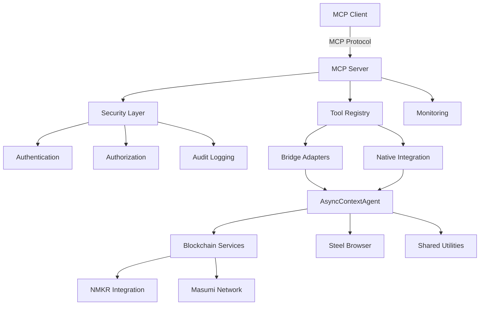
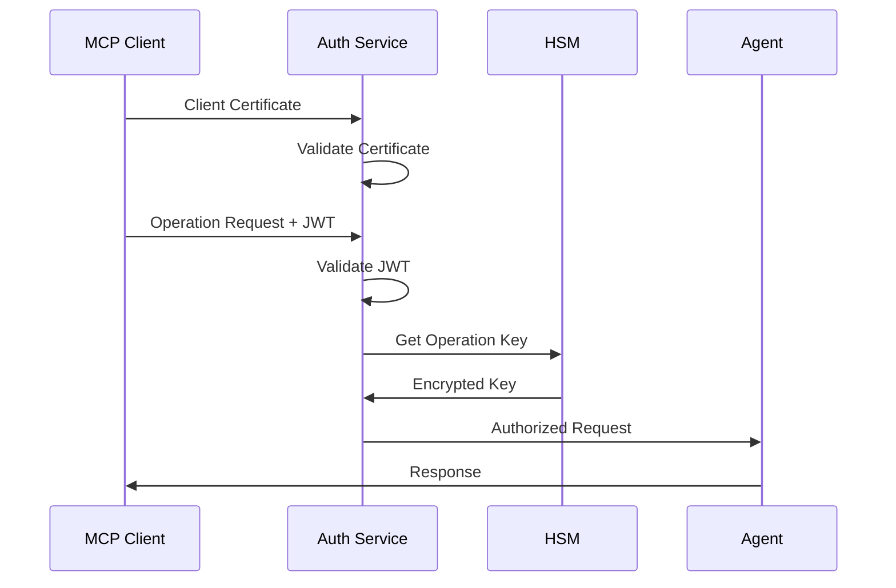

# Agent Forge MCP Technical Architecture

## Overview

This document defines the technical architecture for integrating Model Context Protocol (MCP) support into Agent Forge, enabling the framework's blockchain-enhanced AI agents to participate in Anthropic's ecosystem while maintaining production-grade reliability and security.

**Architecture Goals**:
- Preserve Agent Forge's AsyncContextAgent foundation and performance characteristics
- Enable secure exposure of blockchain capabilities (NMKR, Masumi Network) through MCP
- Maintain backward compatibility with existing CLI and API interfaces
- Achieve <10% performance overhead for MCP operations
- Support enterprise-grade security, monitoring, and compliance requirements

---

## High-Level Architecture

### System Overview
```
┌─────────────────────────────────────────────────────────────────┐
│                    Agent Forge MCP Integration                  │
├─────────────────────────────────────────────────────────────────┤
│  MCP Clients (Claude Desktop, Third-Party)                     │
├─────────────────────────────────────────────────────────────────┤
│  MCP Protocol Layer                                            │
│  ├── Protocol Handler      ├── Security Layer                  │
│  ├── Tool Registry        ├── Monitoring                      │
│  └── Resource Manager     └── Audit Logging                   │
├─────────────────────────────────────────────────────────────────┤
│  Integration Layer                                             │
│  ├── Bridge Adapters      ├── Native MCP Support              │
│  ├── CLI Interface Bridge ├── AsyncContextAgent Enhancement    │
│  └── Blockchain Bridge    └── Performance Optimization         │
├─────────────────────────────────────────────────────────────────┤
│  Agent Forge Core                                             │
│  ├── AsyncContextAgent    ├── Blockchain Integration           │
│  ├── CLI Interface        ├── NMKR Proof-of-Execution         │
│  ├── Testing Framework    ├── Masumi Network                  │
│  └── Steel Browser        └── Shared Utilities                │
└─────────────────────────────────────────────────────────────────┘
```

### Component Interactions


---

## Component Architecture

### 1. MCP Protocol Layer

#### MCP Server Core
**Responsibility**: Handle MCP protocol compliance and client communication

```python
class MCPServer:
    """Core MCP server implementation for Agent Forge."""

    def __init__(self, config: MCPServerConfig):
        self.protocol_handler = MCPProtocolHandler()
        self.tool_registry = ToolRegistry()
        self.resource_manager = ResourceManager()
        self.security_layer = SecurityLayer(config.security)
        self.monitor = MCPMonitor()

    async def handle_request(self, request: MCPRequest) -> MCPResponse:
        """Handle incoming MCP requests with security and monitoring."""
        # Security validation
        await self.security_layer.validate_request(request)

        # Route to appropriate handler
        if request.type == "tool":
            return await self.handle_tool_request(request)
        elif request.type == "resource":
            return await self.handle_resource_request(request)

        # Monitor and audit
        await self.monitor.log_request(request, response)
        return response
```

#### Protocol Handler
**Responsibility**: MCP specification compliance and message processing

```python
class MCPProtocolHandler:
    """Handles MCP protocol specification compliance."""

    async def validate_message(self, message: MCPMessage) -> bool:
        """Validate message format against MCP specification."""
        pass

    async def serialize_response(self, response: Any) -> MCPMessage:
        """Serialize Agent Forge responses to MCP format."""
        pass

    async def deserialize_request(self, message: MCPMessage) -> MCPRequest:
        """Parse MCP requests into Agent Forge format."""
        pass
```

### 2. Integration Layer

#### Bridge Adapters (Phase 1 Implementation)
**Responsibility**: Translate between Agent Forge and MCP interfaces

```python
class AsyncContextAgentBridge:
    """Bridge adapter for AsyncContextAgent to MCP Tool interface."""

    def __init__(self, agent: AsyncContextAgent):
        self.agent = agent
        self.config = agent.config

    async def to_mcp_tool(self) -> MCPTool:
        """Convert AsyncContextAgent to MCP Tool definition."""
        return MCPTool(
            name=self.agent.name,
            description=self.agent.__doc__ or f"Agent Forge {self.agent.name}",
            parameters=self._extract_parameters(),
            handler=self._create_handler()
        )

    async def execute_via_mcp(self, params: Dict[str, Any]) -> MCPResult:
        """Execute agent through MCP interface."""
        # Map MCP parameters to agent format
        agent_params = self._map_parameters(params)

        # Execute agent with context preservation
        async with self.agent as agent_context:
            result = await agent_context.run(**agent_params)

        # Convert result to MCP format
        return self._format_mcp_result(result)
```

#### CLI Interface Bridge
**Responsibility**: Expose CLI-discovered agents through MCP

```python
class CLIBridge:
    """Bridge for exposing CLI-discovered agents via MCP."""

    def __init__(self, cli_manager: CLIManager):
        self.cli_manager = cli_manager

    async def discover_agents(self) -> List[MCPTool]:
        """Discover all CLI-available agents and convert to MCP tools."""
        agents = await self.cli_manager.discover_agents()
        mcp_tools = []

        for agent_class in agents:
            bridge = AsyncContextAgentBridge(agent_class())
            tool = await bridge.to_mcp_tool()
            mcp_tools.append(tool)

        return mcp_tools
```

#### Blockchain Operations Bridge
**Responsibility**: Secure exposure of blockchain capabilities

```python
class BlockchainBridge:
    """Secure bridge for blockchain operations via MCP."""

    def __init__(self, security_config: BlockchainSecurityConfig):
        self.nmkr_client = NMKRClient()
        self.masumi_client = MasumiClient()
        self.security = BlockchainSecurity(security_config)

    async def create_proof_tool(self) -> MCPTool:
        """Create MCP tool for NMKR proof generation."""
        return MCPTool(
            name="nmkr_proof_generation",
            description="Generate NMKR Proof-of-Execution NFT",
            parameters=self._proof_parameters(),
            handler=self._secure_proof_handler(),
            security_tier=SecurityTier.FINANCIAL
        )

    async def _secure_proof_handler(self, params: Dict[str, Any]) -> MCPResult:
        """Secure handler for proof generation with HSM integration."""
        # Validate security context
        await self.security.validate_financial_operation(params)

        # Generate proof with audit logging
        with self.security.audit_context("nmkr_proof_generation"):
            proof = await self.nmkr_client.generate_proof(params)

        return MCPResult(success=True, data=proof)
```

### 3. Native MCP Integration (Phase 2+ Implementation)

#### Enhanced AsyncContextAgent
**Responsibility**: Native MCP support in Agent Forge core

```python
class AsyncContextAgentMCP(AsyncContextAgent):
    """AsyncContextAgent with native MCP support."""

    def __init__(self, name: str = None, config: dict = None, mcp_config: MCPConfig = None):
        super().__init__(name, config)
        self.mcp_config = mcp_config or MCPConfig()
        self.mcp_tools = []
        self.mcp_resources = []

    async def register_mcp_tool(self, tool_def: MCPToolDefinition):
        """Register this agent as an MCP tool."""
        self.mcp_tools.append(tool_def)

    async def provide_mcp_resource(self, resource_def: MCPResourceDefinition):
        """Provide resources accessible via MCP."""
        self.mcp_resources.append(resource_def)

    async def execute_mcp_request(self, request: MCPRequest) -> MCPResponse:
        """Handle MCP requests natively within agent context."""
        # Preserve async context and error handling
        try:
            result = await self._handle_mcp_request_internal(request)
            return MCPResponse(success=True, result=result)
        except Exception as e:
            self.logger.error(f"MCP request failed: {e}")
            return MCPResponse(success=False, error=str(e))
```

## Performance Specifications

### Latency Targets
| Operation Type | Target Latency | Maximum Latency |
|----------------|----------------|-----------------|
| Tool Discovery | <100ms | <500ms |
| Simple Agent Execution | <2s | <10s |
| Blockchain Read Operation | <500ms | <2s |
| Blockchain Write Operation | <5s | <30s |
| Resource Access | <200ms | <1s |

### Throughput Targets
| Metric | Target | Maximum Load |
|--------|--------|--------------|
| Concurrent Clients | 1000 | 5000 |
| Requests per Second | 500 | 2000 |
| Agent Executions per Minute | 1000 | 5000 |
| Blockchain Operations per Hour | 100 | 500 |

## Security Architecture

### Authentication Flow


### Authorization Matrix
| Operation | MCP Client Auth | User Auth | Financial Auth | Admin Auth |
|-----------|----------------|-----------|----------------|------------|
| List Tools | Required | - | - | - |
| Execute Read-Only Agent | Required | Required | - | - |
| Execute Agent with Blockchain Read | Required | Required | - | - |
| Execute NMKR Proof Generation | Required | Required | Required | - |
| Execute Payment Operations | Required | Required | Required | - |
| Modify System Configuration | Required | Required | Required | Required |

---

## Integration with TrustWrapper

### TrustWrapper MCP Integration
The MCP architecture seamlessly integrates with TrustWrapper's AI safety verification capabilities:

```python
class TrustWrapperMCPBridge:
    """Bridge TrustWrapper verification with MCP protocol."""

    async def create_verification_tool(self) -> MCPTool:
        """Create MCP tool for AI trading verification."""
        return MCPTool(
            name="trustwrapper_verification",
            description="Verify AI trading decisions for safety and compliance",
            parameters=self._verification_parameters(),
            handler=self._verification_handler(),
            security_tier=SecurityTier.FINANCIAL
        )

    async def _verification_handler(self, params: Dict[str, Any]) -> MCPResult:
        """Handle verification requests through MCP."""
        verification_engine = LocalVerificationEngine()
        result = await verification_engine.verify_trading_decision(params)

        return MCPResult(
            success=True,
            data={
                "verified": result.is_safe,
                "confidence": result.confidence,
                "explanation": result.explanation,
                "oracle_consensus": result.oracle_data
            }
        )
```

### Oracle Verification Integration
```python
class OracleVerificationMCPService:
    """MCP service for oracle-based verification."""

    async def create_oracle_tools(self) -> List[MCPTool]:
        """Create MCP tools for oracle verification services."""
        return [
            MCPTool(
                name="mento_oracle_verification",
                description="Verify price data against Mento Protocol oracles",
                handler=self._mento_verification_handler
            ),
            MCPTool(
                name="multi_oracle_consensus",
                description="Achieve consensus across multiple oracle sources",
                handler=self._consensus_handler
            )
        ]
```

## Conclusion

This technical architecture provides comprehensive MCP integration while maintaining TrustWrapper's unique AI safety capabilities and enterprise-grade security features. The architecture supports both Agent Forge's extensibility goals and TrustWrapper's market leadership in AI trading safety.

---

*Document Version: 1.0*
*Last Updated: June 26, 2025*
*Integration Status: Phase 1 Planning*
