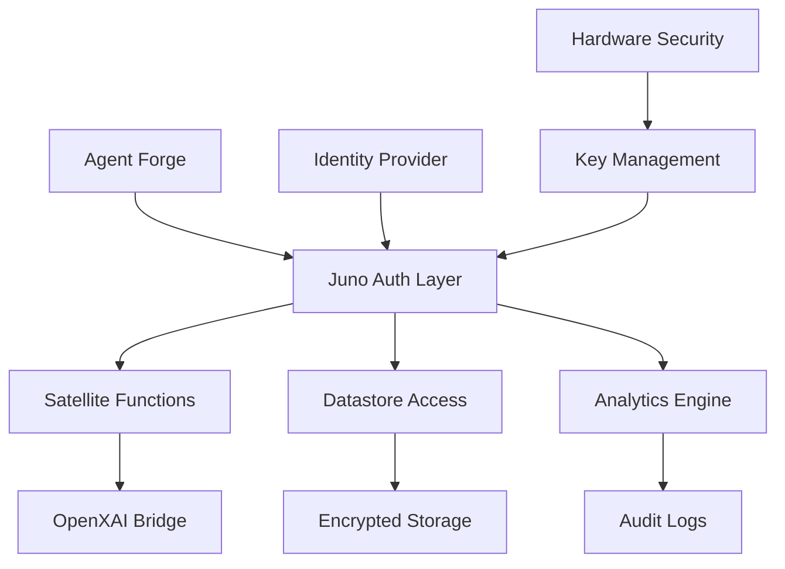

# 🛰️ Juno Satellite Access Control Guide

**Last Updated**: June 19, 2025
**Version**: 1.0
**Status**: Production Ready
**Classification**: CONFIDENTIAL

## 🎯 Overview

This document provides comprehensive access control guidelines for Juno satellite integration with the Agent Forge framework. It covers authentication, authorization, key management, and security best practices specific to Juno's serverless platform.

## 📋 Table of Contents

1. [Architecture Overview](#architecture-overview)
2. [Authentication Systems](#authentication-systems)
3. [Authorization Framework](#authorization-framework)
4. [Key Management](#key-management)
5. [Network Security](#network-security)
6. [Data Protection](#data-protection)
7. [Monitoring & Auditing](#monitoring--auditing)
8. [Incident Response](#incident-response)
9. [Configuration Examples](#configuration-examples)
10. [Troubleshooting](#troubleshooting)

## 🏗️ Architecture Overview

### Juno Satellite Integration Architecture


### Security Layers
1. **Identity Layer**: User authentication and identity verification
2. **Authorization Layer**: Permission-based access control
3. **Transport Layer**: Encrypted communications (TLS 1.3)
4. **Application Layer**: Function-level security controls
5. **Data Layer**: Encryption at rest and in transit
6. **Audit Layer**: Comprehensive logging and monitoring

## 🔐 Authentication Systems

### Internet Identity Integration
```typescript
// Internet Identity authentication setup
import { AuthClient } from "@dfinity/auth-client";

const authConfig = {
  // Juno-specific authentication configuration
  identityProvider: "https://identity.ic0.app",
  maxTimeToLive: BigInt(8 * 60 * 60 * 1000 * 1000 * 1000), // 8 hours
  windowOpenerFeatures: "toolbar=0,location=0,menubar=0,width=500,height=500",
  derivationOrigin: "https://your-satellite.icp0.io"
};

const authClient = await AuthClient.create(authConfig);
```

### Multi-Factor Authentication (MFA)
```typescript
// MFA configuration for Juno access
const mfaConfig = {
  required: true,
  methods: ["totp", "hardware_key", "biometric"],
  gracePeriod: 300, // 5 minutes
  backupCodes: 10
};

// Hardware security key integration
const webAuthnConfig = {
  rpId: "your-satellite.icp0.io",
  rpName: "Agent Forge Satellite",
  attestation: "direct",
  authenticatorSelection: {
    authenticatorAttachment: "platform",
    userVerification: "required"
  }
};
```

### Session Management
```typescript
// Secure session configuration
const sessionConfig = {
  timeout: 3600, // 1 hour
  renewalThreshold: 300, // 5 minutes before expiry
  concurrentSessions: 3,
  ipBinding: true,
  geoRestrictions: ["US", "EU", "CA"]
};
```

## 🛡️ Authorization Framework

### Role-Based Access Control (RBAC)
```yaml
# Juno satellite RBAC configuration
roles:
  satellite_admin:
    permissions:
      - satellite:admin:*
      - functions:deploy:*
      - datastore:admin:*
      - analytics:read:*
      - keys:rotate:*
    restrictions:
      - geo_location: ["secure_regions"]
      - ip_whitelist: ["admin_ips"]
      - mfa_required: true

  satellite_developer:
    permissions:
      - functions:deploy:own
      - functions:invoke:*
      - datastore:read:*
      - datastore:write:own
      - analytics:read:basic
    restrictions:
      - rate_limit: 1000/hour
      - geo_location: ["allowed_regions"]

  satellite_viewer:
    permissions:
      - functions:invoke:public
      - datastore:read:public
      - analytics:read:basic
    restrictions:
      - rate_limit: 100/hour
      - read_only: true
```

### Attribute-Based Access Control (ABAC)
```json
{
  "policy": {
    "name": "satellite_access_policy",
    "rules": [
      {
        "effect": "allow",
        "conditions": {
          "user.role": "satellite_admin",
          "time.hour": {">=": 6, "<=": 22},
          "request.ip": {"in": "admin_ip_range"},
          "resource.sensitivity": {"<=": "confidential"}
        }
      },
      {
        "effect": "deny",
        "conditions": {
          "user.failed_logins": {">": 3},
          "time.duration": {"<": "24h"}
        }
      }
    ]
  }
}
```

## 🔑 Key Management

### Satellite Key Hierarchy
```
Root Key (Hardware Security Module)
├── Satellite Master Key (AES-256)
│   ├── Function Encryption Keys
│   ├── Datastore Encryption Keys
│   └── Communication Keys
├── User Authentication Keys
│   ├── Identity Keys (Ed25519)
│   └── Session Keys (HMAC-SHA256)
└── Audit Signing Keys (RSA-4096)
```

### Key Rotation Strategy
```typescript
// Automated key rotation configuration
const keyRotationConfig = {
  satellite_master_key: {
    interval: "30d",
    notification: "7d",
    backup_required: true
  },
  function_keys: {
    interval: "7d",
    automatic: true
  },
  session_keys: {
    interval: "24h",
    on_login: true
  },
  emergency_rotation: {
    trigger: ["security_incident", "key_compromise"],
    notification: "immediate"
  }
};
```

### Hardware Security Module (HSM) Integration
```typescript
// HSM configuration for production environments
const hsmConfig = {
  provider: "CloudHSM",
  cluster_id: "satellite-hsm-cluster",
  key_spec: "ECC_NIST_P256",
  operations: ["sign", "verify", "encrypt", "decrypt"],
  backup_regions: ["us-east-1", "eu-west-1"],
  compliance: ["FIPS-140-2-Level-3", "Common-Criteria-EAL5"]
};
```

## 🌐 Network Security

### Transport Layer Security
```typescript
// TLS configuration for Juno communications
const tlsConfig = {
  version: "1.3",
  cipherSuites: [
    "TLS_AES_256_GCM_SHA384",
    "TLS_CHACHA20_POLY1305_SHA256",
    "TLS_AES_128_GCM_SHA256"
  ],
  certificateValidation: "strict",
  hsts: {
    maxAge: 31536000,
    includeSubDomains: true,
    preload: true
  }
};
```

### API Gateway Security
```typescript
// Juno API gateway security configuration
const apiGatewayConfig = {
  rateLimiting: {
    requests_per_minute: 1000,
    burst_capacity: 2000,
    key_extraction: "user_id"
  },
  cors: {
    allowed_origins: ["https://agent-forge.ai"],
    allowed_methods: ["GET", "POST", "PUT", "DELETE"],
    allowed_headers: ["Authorization", "Content-Type"],
    credentials: true
  },
  authentication: {
    required: true,
    bearer_token: true,
    api_key_header: "X-API-Key"
  }
};
```

### DDoS Protection
```yaml
# DDoS protection configuration
ddos_protection:
  enable: true
  threshold_pps: 10000  # packets per second
  threshold_bps: "100Mbps"  # bits per second
  mitigation:
    - rate_limiting
    - geo_blocking
    - challenge_response
  whitelist:
    - agent_forge_ips
    - trusted_partners
```

## 🔒 Data Protection

### Encryption Standards
```typescript
// Data encryption configuration
const encryptionConfig = {
  at_rest: {
    algorithm: "AES-256-GCM",
    key_management: "customer_managed",
    rotation_period: "90d"
  },
  in_transit: {
    algorithm: "TLS_1.3",
    certificate_authority: "lets_encrypt",
    perfect_forward_secrecy: true
  },
  application_level: {
    sensitive_fields: ["api_keys", "user_data", "logs"],
    algorithm: "ChaCha20-Poly1305"
  }
};
```

### Data Classification
```yaml
# Data classification for Juno satellite
data_classification:
  public:
    - documentation
    - public_apis
    - marketing_content

  internal:
    - system_logs
    - performance_metrics
    - user_analytics

  confidential:
    - user_credentials
    - api_keys
    - configuration_files

  restricted:
    - private_keys
    - audit_logs
    - security_incidents
```

### Privacy Controls
```typescript
// Privacy and GDPR compliance configuration
const privacyConfig = {
  data_minimization: true,
  purpose_limitation: true,
  retention_periods: {
    user_data: "2y",
    logs: "1y",
    analytics: "6m"
  },
  user_rights: {
    access: true,
    rectification: true,
    erasure: true,
    portability: true
  }
};
```

## 📊 Monitoring & Auditing

### Security Event Monitoring
```typescript
// Security monitoring configuration
const monitoringConfig = {
  events: {
    authentication: {
      failed_logins: { threshold: 5, window: "5m" },
      successful_logins: { log_level: "info" },
      privilege_escalation: { alert: "immediate" }
    },
    authorization: {
      denied_access: { threshold: 10, window: "1m" },
      permission_changes: { alert: "immediate" }
    },
    data_access: {
      bulk_downloads: { threshold: 1000, window: "1h" },
      sensitive_data_access: { log_level: "warn" }
    }
  },
  alerting: {
    channels: ["email", "slack", "sms"],
    escalation: {
      level_1: "security_team",
      level_2: "security_manager",
      level_3: "ciso"
    }
  }
};
```

### Audit Trail Requirements
```yaml
# Comprehensive audit logging
audit_logging:
  events:
    - user_authentication
    - permission_changes
    - data_access
    - system_configuration
    - security_incidents

  format: "json"
  retention: "7y"
  integrity: "cryptographic_signing"

  fields:
    - timestamp
    - user_id
    - action
    - resource
    - ip_address
    - user_agent
    - outcome
    - risk_score
```

### Security Metrics
```typescript
// Key security metrics for monitoring
const securityMetrics = {
  authentication: {
    success_rate: { target: ">95%" },
    average_response_time: { target: "<500ms" },
    mfa_adoption: { target: ">90%" }
  },
  authorization: {
    policy_violations: { target: "0" },
    privilege_escalations: { target: "0" }
  },
  data_protection: {
    encryption_coverage: { target: "100%" },
    data_breaches: { target: "0" }
  }
};
```

## 🚨 Incident Response

### Security Incident Classification
```yaml
# Incident severity levels
severity_levels:
  critical:
    description: "System compromise, data breach"
    response_time: "15m"
    escalation: "immediate"

  high:
    description: "Attempted breach, service disruption"
    response_time: "1h"
    escalation: "4h"

  medium:
    description: "Policy violations, failed access attempts"
    response_time: "4h"
    escalation: "24h"

  low:
    description: "Minor security events"
    response_time: "24h"
    escalation: "weekly_review"
```

### Automated Response Actions
```typescript
// Automated incident response configuration
const incidentResponse = {
  triggers: {
    multiple_failed_logins: {
      action: "temporary_account_lock",
      duration: "15m"
    },
    suspicious_api_activity: {
      action: "rate_limit_increase",
      factor: 0.1
    },
    potential_data_exfiltration: {
      action: "immediate_alert",
      escalation: "security_team"
    }
  },
  containment: {
    isolate_user: true,
    preserve_evidence: true,
    notify_stakeholders: true
  }
};
```

## ⚙️ Configuration Examples

### Production Juno Configuration
```typescript
// Production-ready Juno satellite configuration
import { initSatellite } from "@junobuild/core";

const productionConfig = {
  satelliteId: "your-production-satellite-id",
  workers: {
    auth: true,
    storage: true,
    functions: true
  },
  security: {
    authentication: {
      internet_identity: true,
      anonymous: false,
      session_expires_in: 3600000n // 1 hour
    },
    storage: {
      read: "controllers",
      write: "controllers",
      delete: "controllers"
    },
    functions: {
      execute: "authenticated"
    }
  },
  monitoring: {
    analytics: true,
    performance: true,
    errors: true
  }
};

await initSatellite(productionConfig);
```

### Development Environment Configuration
```typescript
// Development environment with additional security
const developmentConfig = {
  satelliteId: "your-dev-satellite-id",
  security: {
    authentication: {
      internet_identity: true,
      anonymous: true, // Allow for testing
      session_expires_in: 7200000n // 2 hours
    },
    cors: {
      allowed_origins: ["http://localhost:3000"],
      credentials: true
    },
    rate_limiting: {
      enabled: true,
      requests_per_minute: 100
    }
  },
  logging: {
    level: "debug",
    include_request_body: true
  }
};
```

### Enterprise Security Configuration
```typescript
// Enterprise-grade security configuration
const enterpriseConfig = {
  satelliteId: "enterprise-satellite-id",
  security: {
    authentication: {
      internet_identity: true,
      multi_factor_required: true,
      session_binding: {
        ip_address: true,
        user_agent: true
      }
    },
    authorization: {
      rbac_enabled: true,
      abac_enabled: true,
      policy_evaluation: "strict"
    },
    encryption: {
      at_rest: "AES-256-GCM",
      in_transit: "TLS-1.3",
      key_rotation: "30d"
    },
    audit: {
      comprehensive_logging: true,
      real_time_monitoring: true,
      compliance_reporting: true
    }
  }
};
```

## 🔧 Troubleshooting

### Common Security Issues

#### Authentication Failures
```typescript
// Debug authentication issues
const debugAuth = async () => {
  try {
    const authClient = await AuthClient.create();
    const isAuthenticated = await authClient.isAuthenticated();

    if (!isAuthenticated) {
      console.log("User not authenticated");
      console.log("Available identity providers:", authClient.getIdentity());
    }
  } catch (error) {
    console.error("Authentication error:", error);
  }
};
```

#### Permission Denied Errors
```typescript
// Debug authorization issues
const debugAuthorization = async (userId: string, resource: string, action: string) => {
  const permissions = await getUserPermissions(userId);
  const hasPermission = checkPermission(permissions, resource, action);

  console.log(`User ${userId} permissions:`, permissions);
  console.log(`Access to ${resource}.${action}:`, hasPermission);

  if (!hasPermission) {
    console.log("Required permissions:", getRequiredPermissions(resource, action));
  }
};
```

#### Network Connectivity Issues
```bash
# Network connectivity troubleshooting
# Test satellite connectivity
curl -v https://your-satellite.icp0.io/health

# Check DNS resolution
nslookup your-satellite.icp0.io

# Verify SSL/TLS configuration
openssl s_client -connect your-satellite.icp0.io:443 -servername your-satellite.icp0.io
```

### Security Audit Checklist
```yaml
# Pre-deployment security checklist
security_checklist:
  authentication:
    - [ ] Internet Identity integration tested
    - [ ] MFA configuration verified
    - [ ] Session management configured

  authorization:
    - [ ] RBAC policies defined
    - [ ] Permission boundaries tested
    - [ ] Privilege escalation prevented

  encryption:
    - [ ] Data encryption at rest enabled
    - [ ] TLS 1.3 for all communications
    - [ ] Key rotation implemented

  monitoring:
    - [ ] Security event logging enabled
    - [ ] Real-time alerting configured
    - [ ] Audit trail compliance verified

  compliance:
    - [ ] GDPR requirements met
    - [ ] Industry standards compliance
    - [ ] Regular security assessments scheduled
```

## 📚 Additional Resources

### Documentation
- [Juno Official Documentation](https://juno.build/docs)
- [Internet Computer Security Guide](https://internetcomputer.org/docs/current/references/security/)
- [Agent Forge Security Guide](../SECURITY_GUIDE.md)

### Security Tools
- [Juno CLI Security Commands](https://juno.build/docs/cli)
- [dfx Security Features](https://internetcomputer.org/docs/current/developer-docs/setup/install/)
- [Security Testing Scripts](../tools/security/)

### Compliance Frameworks
- [SOC 2 Type II](https://www.aicpa.org/interestareas/frc/assuranceadvisoryservices/aicpasoc2report.html)
- [ISO 27001](https://www.iso.org/isoiec-27001-information-security.html)
- [GDPR Compliance](https://gdpr-info.eu/)

## 📞 Support Contacts

### Internal Security Team
- **Security Lead**: security@agent-forge.ai
- **DevSecOps**: devsecops@agent-forge.ai
- **Incident Response**: incident@agent-forge.ai

### External Support
- **Juno Support**: support@juno.build
- **Internet Computer**: support@dfinity.org
- **Emergency Security**: +1-555-SEC-JUNO

---

**⚠️ CONFIDENTIALITY NOTICE**
This document contains confidential security information for Juno satellite access controls. Distribution is restricted to authorized personnel only.

**🔒 CLASSIFICATION**: CONFIDENTIAL
**📅 REVIEW DATE**: Monthly
**👥 AUTHORIZED USERS**: Security Team, Senior Engineers, Platform Administrators

**Last Updated**: June 19, 2025
**Document Version**: 1.0
**Next Review**: July 19, 2025
